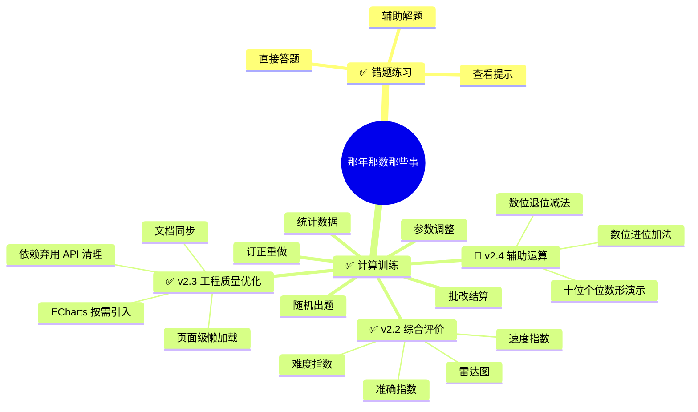
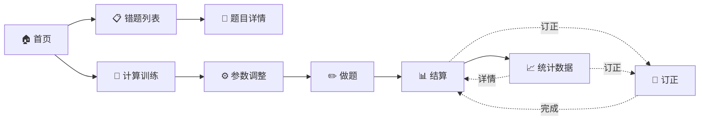

# 那年那数那些事

> 一个帮助一年级小朋友攻克数学易错题的交互式学习网站。

通过**图形动画 + 分步引导**的方式，把每道错题的思维过程可视化，配合随机换参反复练习，真正搞懂而不是背答案。

👉 **在线体验**：<https://soapgu.github.io/that-math-things>

---

## 目录

- [在线地址](#在线地址)
- [技术栈](#技术栈)
- [功能概览](#功能概览)
- [交互模式详解](#交互模式详解)

- [目录结构](#目录结构)
- [开发指南](#开发指南)
  - [环境准备](#环境准备)
  - [启动项目](#启动项目)
  - [目录说明](#目录说明)
  - [如何新增一道题](#如何新增一道题)
- [构建部署](#构建部署)
- [更新步骤](#更新步骤)
- [项目命名](#项目命名)
- [功能文档](#功能文档)
- [v2.3 工程质量优化](#v23-工程质量优化)
- [v2.4 规划（辅助运算分步引导）](#v24-规划辅助运算分步引导)

---

## 在线地址

**<https://soapgu.github.io/that-math-things>**

---

## 技术栈

| 类别 | 选择 |
| --- | --- |
| 框架 | Vite 6 + React 19 |
| 语言 | JavaScript (ES6+) |
| UI 组件库 | Ant Design 6 |
| 路由 | react-router-dom v6 |
| 动画引擎 | framer-motion |
| 图形 | `motion.div` + CSS（非 SVG，用 DOM 元素配合 framer-motion 属性动画实现） |
| 图表 | ECharts 6（按需注册） |
| 测试 | Vitest 3 + Testing Library |

---

## 功能概览




### 页面导航



| 路由 | 页面 | 说明 |
| --- | --- | --- |
| `/` | 首页 | 两个入口卡片：错题列表 / 计算训练 |
| `/problems` | 题目列表 | 按知识点分类展示 |
| `/problems/:id` | 题目详情 | 三种互动模式切换 + 随机换参 |
| `/practice` | 计算训练参数 | 调整运算范围/比例/概率/辅助运算/题数 |
| `/practice/session` | 计算训练做题 | 计时 + 随机出题 + 提交下一题 |
| `/practice/result` | 结算页 | 批改得分 + 错误分析 + 逐题详情 |
| `/practice/stats` | 统计数据 | 历史记录 + 错误分布统计 |
| `/practice/correction` | 订正页 | 对本次错题逐题重做，直到全部答对 |

### 三种互动模式

每道题都支持以下三种模式，顶部标签切换：

| 模式 | 交互流程 |
| --- | --- |
| **直接答题** | 显示题目 → 输入答案 → 提交判对错 → 显示结果。支持单答案/多答案、文本输入/选择题（Radio）混合，多答案回车自动跳空或提交。 |
| **查看提示** | 显示思考指引文字（思路点拨） |
| **辅助解题** | 见下方详解 |

---

## 交互模式详解

### 辅助解题状态流

```
开始
  │
  ▼
自动播放动画演示
  │
  ▼
进入步骤时间线（所有步骤同时可见）
  ┌──────────────────────────────────────┐
  │ ✅ 第 1 步（已完成）  你的答案：13 ✓  │
  │ ✅ 第 2 步（已完成）  你的答案：5  ✓  │
  │ ▶ 第 3 步 ← 当前                    │
  │    ┌─────────────────────┐           │
  │    │  [输入框]    [确认] │           │
  │    └─────────────────────┘           │
  │ ○ 第 4 步（等待）                    │
  └──────────────────────────────────────┘
       │ 每步确认正确 → 自动跳到下一步
       │ 最后一步正确 → 显示完成
       │ 任何一步错误 → 原地重填
       ▼
全部答对 ✅ → 展示所有步骤结果 + 庆祝
```

**关键规则：**
- 动画自动播放，可跳过
- 所有步骤同时显示在时间线中，已完成/当前/未到一目了然
- 每步正确后输入框自动聚焦到下一步
- 任何一步答错，保留输入框可重填，不阻塞流程
- 最后一步正确即完成全部，无独立的"最终答案"阶段
- 随时可点击「重新开始」或「随机换参」

### 直接答题状态流

```
显示题目 → 随机参数已生成 → 填写答案 → 提交
  ├─ 正确 ✅ 显示正确 + 简要解释
  └─ 错误 ❌ 显示正确答案 + 简要解释
```

**扩展功能：**
- **多答案**：支持一道题有多个填空（如增减问题的"填方向 + 填数量"），每空独立判对错
- **选择题**：答案类型支持 `choice`，渲染为 Ant Design `Radio.Group`，选项可自定义标签和值
- **回车跳空**：多答案时按 Enter，如有空输入则自动跳到下一个空位，全部填满才提交
- **自动聚焦**：首次进入或随机换参后，自动聚焦第一个输入框（支持 Text / Radio）

### 查看提示状态流

```
显示题目 → 点击「查看提示」→ 显示思路文字
  → 用户可切到直接答题或辅助解题继续
```

---


## 目录结构

```
that-math-things/
├── public/
│   ├── index.html
│   └── favicon.ico
├── src/
│   ├── components/                    # 通用组件
│   │   ├── AppLayout/                 # 页面布局 (Header/Content)
│   │   ├── ProblemCard/               # 题目卡片（首页/列表使用）
│   │   └── animations/                # 每道题的可视化动画（motion.div + framer-motion）
│   │       ├── ComputerNumber/        # 题1 电脑编号
│   │       ├── StickerProblem/        # 题2 贴纸问题
│   │       ├── AppleEaten/            # 题3 吃苹果
│   │       └── BasketChange/          # 题4 增减问题
│   ├── pages/                         # 页面
│   │   ├── Home/                      # 首页（两个入口卡片）
│   │   ├── Problems/                  # 题目列表
│   │   ├── ProblemDetail/             # 题目详情（三种模式）
│   │   └── Practice/                  # 计算训练
│   │       ├── Settings/              # 参数调整页
│   │       ├── Session/               # 做题页
│   │       ├── Result/                # 结算页
│   │       ├── Stats/                 # 统计数据页
│   │       └── Correction/            # 错题订正页
│   ├── problems/                      # 题目数据定义
│   │   ├── registry.js                # 题目注册表
│   │   └── data/                      # 每题的定义 + 参数生成器
│   │       ├── computerNumber.js
│   │       ├── stickerProblem.js
│   │       ├── appleEaten.js
│   │       └── basketChange.js
│   ├── hooks/                         # 自定义 Hooks
│   │   ├── useGuidedSolve.js          # 辅助解题状态机
│   │   └── useTimer.js                # 计时器
│   ├── utils/
│   │   ├── random.js                  # 随机参数生成工具
│   │   ├── mathGenerator.js           # 计算题生成器
│   │   ├── marking.js                 # 批改引擎
│   │   ├── evaluation.js              # 综合评价计算
│   │   ├── echarts.js                 # ECharts 按需注册
│   │   └── storage.js                 # localStorage 存储
│   ├── App.jsx                        # 路由配置 + 页面级懒加载
│   └── index.jsx                      # 入口
├── .gitignore
├── package.json
└── README.md
```

---

## 开发指南

### 环境准备

- Node.js >= 18
- npm >= 8

### 启动项目

```bash
# 安装依赖
npm install

# 启动开发服务器
npm start

# 运行测试（TDD）
npm test

# 浏览器会自动打开 http://localhost:5173/that-math-things/
```

### 如何新增一道题

1. 在 `src/problems/data/` 下新建文件，按以下模板定义：

```javascript
// src/problems/data/yourProblem.js
import { getRandomInt } from '../../utils/random';

const createProblem = () => {
  // 1. 生成随机参数
  const param1 = getRandomInt(1, 10);
  const param2 = getRandomInt(1, 10);
  const finalAnswer = param1 + param2;

  // 2. 直接答题的答案定义
  //    - 单答案：answers 数组长度 1
  //    - 多答案：answers 数组长度 > 1，每项独立 label + 判对错
  //    - 选择题：设置 type: 'choice' + options 数组
  const answers = [
    { label: '答案一', answer: finalAnswer },
    { label: '答案二', answer: 5, type: 'choice', options: [
      { label: '选项A', value: 5 },
      { label: '选项B', value: 10 },
    ]},
  ];

  // 3. 分步引导数据
  //    最后一步的 answer 就是最终答案
  const steps = [
    { description: '第一步的题干', hint: '提示文字', answer: '中间结果1' },
    { description: '第二步的题干', hint: '提示文字', answer: '中间结果2' },
    { description: '最终步的题干', hint: '提示文字', answer: finalAnswer },
  ];

  return {
    params: { param1, param2 },
    question: '完整的题目文字，支持 ${param1} 插值',
    hint: '查看提示模式显示的整体思路',
    answers,
    steps,
    finalAnswer,
  };
};

const problem = {
  id: 'your-problem',
  title: '题目标题',
  tags: ['知识点标签'],
  createProblem,
};

export default problem;
```

2. 在 `src/problems/registry.js` 中注册：

```javascript
import yourProblem from './data/yourProblem';

const problemRegistry = {
  'your-problem': yourProblem,
  // ... 已有题目
};
```

3. 在 `src/components/animations/` 下创建动画组件（详见下方「动画组件开发指南」）。

4. 在 `src/pages/ProblemDetail/index.jsx` 的 `AnimationRenderer` 中添加映射：

```javascript
function AnimationRenderer({ problemId, params, onComplete }) {
  switch (problemId) {
    case 'computer-number':
      return <ComputerNumberAnimation params={params} onComplete={onComplete} />;
    case 'your-problem':
      return <YourProblemAnimation params={params} onComplete={onComplete} />;
    // ...
  }
}
```

---

### 动画组件开发指南

动画组件的核心原理是 **状态驱动 + 属性动画**：用 `step` 状态推进时间线，通过 framer-motion 的 `motion.div` 在不同步骤间自动补间过渡。

#### 组件接口

每道题的动画组件接收统一的 props：

```javascript
function YourProblemAnimation({ params, onComplete }) {
  // params:   { key1, key2, ... }  ← 由 createProblem 返回的随机参数
  // onComplete: () => void         ← 动画播放完毕回调，调用后进入步骤填写
}
```

#### 基本结构

```javascript
import React, { useState, useEffect } from 'react';
import { motion } from 'framer-motion';
import { Button } from 'antd';

export default function YourProblemAnimation({ params, onComplete }) {
  const [step, setStep] = useState(0);
  const TOTAL_STEPS = 4;

  // 1. 定时器推进 step
  useEffect(() => {
    if (step < TOTAL_STEPS) {
      const delay = step === 0 ? 2400 : 6600;
      const timer = setTimeout(() => setStep((s) => s + 1), delay);
      return () => clearTimeout(timer);
    }
  }, [step]);

  // 2. 渲染视觉元素
  return (
    <div>
      {elements.map((el) => (
        <motion.div
          key={el.id}
          initial={{ scale: 0, opacity: 0 }}
          animate={{
            scale: 1,
            opacity: 1,
            backgroundColor: step >= 2 ? '#1677ff' : '#b0b0b0',
            x: step >= 3 ? 100 : 0,
          }}
          transition={{ type: 'spring', stiffness: 350, damping: 14 }}
        />
      ))}

      {/* 3. 所有步骤播完显示继续按钮 */}
      {step >= TOTAL_STEPS && (
        <Button type="primary" onClick={onComplete}>继续</Button>
      )}
    </div>
  );
}
```

#### 常用动画技巧

| 效果 | 实现方式 |
| --- | --- |
| **逐步出现** | `delay: (index) * 35ms` |
| **弹跳进入** | `scale: [0, 1.5, 1]`（关键帧数组） |
| **颜色跳变** | 改变 `backgroundColor`，framer-motion 自动补间 |
| **位置移动** | 改变 `x` / `y` 属性 |
| **大小变化** | 改变 `width` / `height` |
| **高亮强调** | 组合 `border`、`boxShadow`、`zIndex` 变化 |
| **闪烁动画** | `animate={{ scale: [1, 1.2, 1] }}` + `transition.repeat` |
| **布局平滑** | `layout` prop 让布局变化自动过渡 |

#### 重要说明

动画并非使用 `<svg>` 元素绘制，而是用 **`motion.div` + CSS** 模拟：
- 每个视觉单元是一个 `motion.div`，通过 `borderRadius` 控制形状
- 布局用 `display: flex` + `flexWrap` 实现排列
- 所有动画由 framer-motion 的 `animate` prop 驱动

---

## 构建部署

```bash
# 构建生产版本
npm run build

# 部署到 GitHub Pages
npm run deploy

# 产物在 build/ 目录，也可手动部署到任何静态服务器
```

---

## 更新步骤

### 日常开发更新

```bash
# 1. 拉取最新代码
git pull

# 2. 安装新依赖（如有 package.json 变更）
npm install

# 3. 启动开发服务器
npm start
```

### 新增题目后的检查清单

- [ ] `src/problems/data/` 下新建了题目定义文件
- [ ] `src/problems/registry.js` 中注册了新题目
- [ ] `src/components/animations/` 下创建了对应的动画组件
- [ ] 题目在首页和列表页正常展示
- [ ] 三种互动模式均可正常使用
- [ ] 随机换参功能正常
- [ ] `npm start` 无报错

### 部署更新

```bash
# 1. 构建
npm run build

# 2. 将 build/ 目录部署到服务器（根据实际部署方式）
# 例如部署到 Vercel / Netlify / Nginx 等

# 3. 验证线上访问正常
```

### Git 工作流

```bash
# 新功能分支
git checkout -b feat/xxx-problem

# 开发完成后
git add .
git commit -m "feat: 新增 xxx 题目"
git checkout main
git merge feat/xxx-problem
git push
```

---

## 项目命名

- 中文名：**那年那数那些事**
- 英文名：`that-math-things`
- 域名（预留）：`thatmaththings.com`

---

*让数学不再可怕，让错题不再反复。*

---

## 功能文档

### 参数设置

| 参数 | 控件 | 说明 |
|---|---|---|
| 运算范围 | Slider | 默认 50，可选 20 / 50 / 100 |
| 加法比例 | Slider 0-100% | 剩余为减法 |
| 进位退位概率 | Slider 0-100% | 涉及进位/退位的题占比 |
| 辅助运算 | Switch | 开启后可在进位、退位题中主动查看数位分步引导 |
| 题目数量 | Radio.Group | 默认 10，可选 10 / 20 / 50 |

### 做题流程

```
开始 → 生成题目 → 启动计时
                  ↓
            ┌──────────────────┐
            │    a ± b = ?     │
            │ [输入框] [下一题] │
            └────────┬─────────┘
                     │
          辅助开启且当前题有进退位？
              ┌──────┴──────┐
             NO            YES
              │             │
              │       显示「需要提示」
              │             │ 用户主动点击
              │       第一层关键提醒
              │        ├─ 我再想想 → 收起
              │        └─ 看看计算方法 → 第二层（Phase 4）
              └──────┬──────┘
                     ↓ 用户填写并提交
                下一题 / 结束 → /practice/result
```

### 结算与评价

**结算功能**

- 百分制得分：`正确数 / 总数 × 100`
- 总用时显示
- 错误分析标签：错误类型 × 次数展示，含严重错误判定
- 逐题详情：题目、用户答案（划线）、正确答案、对错标记、错误标签 + 点评文案
- 存储空间不足自动清理最旧 100 条并提示
- 「再来一次」「统计数据」「返回首页」按钮
- 自动保存记录到 localStorage

**综合评价体系**

每次练习结算时，对本次练习进行三维度星级评价，并展示雷达图 + 综合评语。

| 维度 | 星级范围 | 说明 |
|---|---|---|
| 难度指数 | 1-5★ | 基于运算范围和进退位权重计算 |
| 准确指数 | 1-5★ | 基于本次得分计算 |
| 速度指数 | 1-5★ | 基于预期用时 vs 实际用时计算 |

难度指数算法：

`difficulty = round(cbWeight × rangeScore × 1.2)`，封顶 5★

```
rangeScore:
  ≤10  → 2
  ≤20  → 3
  ≤50  → 5
  ≤100 → 8

cbWeight:
  无进位退位 → 0.4
  有进位     → 0.7
  有退位     → 0.9
```

| | none(0.4) | 进位(0.7) | 退位(0.9) |
|---|---|---|---|
| ≤10 | 1★ | 2★ | 2★ |
| ≤20 | 1★ | 3★ | 3★ |
| ≤50 | 2★ | 4★ | 5★ |
| ≤100 | 4★ | 5★ | 5★ |

单次练习的难度指数为所有题目难度的平均值（四舍五入取整）。

准确指数算法：

| 得分 | 星级 |
|---|---|
| score = 100 | 5★ |
| score ≥ 90 | 4★ |
| score ≥ 80 | 3★ |
| score ≥ 60 | 2★ |
| score < 60 | 1★ |

速度指数算法：

```
每题预期用时(秒) = f(该题难度★)

  难度 1★ → 3s
  难度 2★ → 5s
  难度 3★ → 8s
  难度 4★ → 12s
  难度 5★ → 15s

session 预期总用时 = Σ 每题预期用时
速度比 = 预期总用时 / 实际用时
```

| 速度比 | 星级 | 含义 |
|---|---|---|
| ≥ 1.3 | 5★ | 很快 |
| ≥ 1.1 | 4★ | 偏快 |
| ≥ 0.8 | 3★ | 正常 |
| ≥ 0.5 | 2★ | 偏慢 |
| < 0.5 | 1★ | 很慢 |

综合评级算法：

准确率占主导，难度和速度对等：

```
加权总分 = 准确 × 0.50 + 难度 × 0.25 + 速度 × 0.25
```

准确率封顶规则（准确是门槛，准确率低时其他维度再高也无意义）：

| 准确指数 | 总分上限 |
|---|---|
| 5★ | 无上限 |
| 4★ | 4.5★ |
| 3★ | 3.5★ |
| 2★ | 2.5★ |
| 1★ | 1.5★ |

公式：`totalStars = round(min(准确×0.50 + 难度×0.25 + 速度×0.25, 上限))`

评级体系：

| 总评星级 | 额外条件 | 评级 | 视觉风格 |
|---|---|---|---|
| 5★ | 三项指数均为 5★ | **UR** | 彩虹渐变 + 闪烁边框，最高荣誉 |
| 5★ | 任意一项 < 5★ | **SSR** | 金色 + 发光 |
| 4★ | — | **SR** | 紫色 |
| 3★ | — | **R** | 蓝色 |
| 1-2★ | — | **N** | 灰色 |

评语基于以下规则生成：

- 判断最弱的维度，针对性给出建议
- 判断最强的维度，给予肯定
- 结合整体表现定性
- 评语文案预写规则化模板，后期可迭代

结算页展示：

```
┌───────────────────────────────┐
│       综合评价                 │
│                               │
│      ╔═══════════════╗        │
│      ║     SSR       ║        │
│      ╚═══════════════╝        │
│                               │
│  ┌──────┐ ┌──────┐ ┌──────┐  │
│  │ ★★★  │ │ ★★★★ │ │ ★★   │  │
│  │ 难度  │ │ 准确  │ │ 速度  │  │
│  └──────┘ └──────┘ └──────┘  │
│                               │
│       [ECharts 雷达图]         │
│                               │
│  评语：计算准确率优秀，但速度    │
│  偏慢，建议多做基础练习提高      │
│  反应速度。                    │
└───────────────────────────────┘
```

评价数据存储（`storage.js` 的 `buildRecord` 中新增）：

```js
{
  id, date, score, ...,    // 原有字段
  evaluation: {
    difficulty: 3,          // 1-5★
    accuracy: 4,            // 1-5★
    speed: 2,               // 1-5★
    composite: {
      totalStars: 4,
      grade: 'SR',          // 'UR' | 'SSR' | 'SR' | 'R' | 'N'
      comment: '...'
    }
  }
}
```

没有 `evaluation` 字段的旧记录，在 Stats 趋势图中忽略不展示。

### 统计数据

- 总练习次数、总题数、平均分、最高分
- 累计错误分布（退位错误 / 进位错误 / 计算错误 + 占比柱状图）
- 最近历史记录列表，支持点击查看详情（Stats → Result 闭环导航）
- 难度/准确/速度三线趋势折线图（仅展示含 evaluation 的记录）
- 清除数据（需确认）

### 订正功能

原题一模一样重做，实时批改直到全对；不写记录、不结算，可在历史记录上反复订正。

### 数据存储

使用 localStorage，保存逻辑：Session 完成训练时写入，Result 页纯展示。

当前（v2.2～v2.3）每条记录使用并列数组，通过相同下标关联：

```js
{
  id, date, score, total, correct, wrongCount,
  timeSpent, settings,
  questions: [ /* 原题数据 */ ],
  userAnswers: [ /* 用户答案 */ ],
  results: [
    { isCorrect, errors: string[], detail: string|null }
  ],
  evaluation: {          // v2.2 新增
    difficulty: 3,       // 1-5★
    accuracy: 4,         // 1-5★
    speed: 2,            // 1-5★
    composite: {
      totalStars: 4,
      grade: 'SR',       // 'UR' | 'SSR' | 'SR' | 'R' | 'N'
      comment: '...'
    }
  }
}
```

v2.4 Phase 5 将升级为 `schemaVersion: 2` 和按题聚合的 `items[]`，不再新增依赖下标对应的第四个并列数组。完整目标结构见“v2.4 → 辅助使用记录”。

### v2.3 工程质量优化

本版本优先偿还工程技术债，为后续辅助运算功能提供更稳定的基础。

| 项目 | 调整内容 |
|---|---|
| 首屏性能 | 路由页面改为 `React.lazy` 按页加载，避免一次加载全部业务页面 |
| 图表体积 | ECharts 改为按需注册折线图、饼图、雷达图及所需组件 |
| 构建基线 | 独立缓存块告警阈值设为 600 KB；超过当前 Ant Design/ECharts 基线时继续告警 |
| 路由兼容 | 启用 React Router v7 future flags，提前适配状态更新和相对路径行为 |
| Ant Design 兼容 | `Statistic.valueStyle` 迁移至 `styles.content`，弃用的 `List` 改为语义化列表结构 |
| 文档同步 | 更新 Vite、Vitest、`.jsx` 文件、订正路由和当前版本规划 |

### v2.4 规划：辅助运算分步引导

#### 设计目标

v2.4 提供按需辅助运算：孩子遇到进位或退位困难时主动求助，通过轻量提醒和数形结合演示唤回计算方法并加深记忆。辅助不是默认做题流程，不代替作答，目标是让孩子逐步减少提示并最终独立完成计算。

设计原则：

- **按需唤起**：只有用户点击辅助按钮后才展示提示，不自动打断做题。
- **聚焦难点**：只辅助确实涉及进位或退位的题目；是否进退位是唯一的难度资格标准。
- **由浅入深**：先给进退位提醒，仍然卡住时再展示完整方法。
- **遵循教材步骤**：加减法均按相同数位对齐、先算个位、再算十位、最后合并的顺序演示；退位后的个位可按设置选择破十法或平十法。
- **不提供依赖**：不自动填写、不自动提交、不因使用辅助直接扣分，动画结束后仍由孩子完成答案。
- **独立接入**：辅助模块只读取当前题目和设置，不改变出题、计时、批改与结算主流程。

#### 功能范围

纳入辅助范围：

- 进位加法：按“个位相加—个位写结果—向十位进 1—十位相加”演示。
- 退位减法：按“十位退 1 到个位—个位相减—十位相减—合并结果”演示。
- 所有真实发生进位或退位的题目，包括结果正好是整十的 `9+1`、`18+2`。

不纳入辅助范围：

- 不进位加法和不退位减法。
- 不发生进位或退位的普通计算；这类题定义为本功能中的“过于简单”。
- 乘除法。
- 应用题已有的“辅助解题”模式；本功能仅服务于计算训练。

辅助资格由实际个位关系判断：个位和大于等于 10 即为进位，且被减数个位小于减数个位即为退位。结果是否正好为整十不影响资格。

#### 设置页调整

保留 `assistEnabled`，并增加只作用于退位个位步骤的 `borrowOnesMethod`：

- `assistEnabled` 表示本次训练中允许主动求助，不表示每题自动展示分步引导。
- 辅助开关说明改为“做题时可主动查看进位、退位提示”。
- 加法固定使用教材中的数位进位步骤，不受该选项影响。
- 减法的退位重组、十位相减和最终合并保持一致，仅个位相减可选择破十法或平十法。
- 默认使用破十法；旧 `assistMethod: breakTen/flatTen` 自动迁移到新字段。
- 辅助关闭时保留但禁用方法选项，便于用户确认下次开启时采用的方法。

#### 做题页入口

辅助入口仅在以下条件全部满足时出现：

```js
settings.assistEnabled &&
assistance.eligible
```

按钮放在题目输入区下方，建议使用灯泡图标和“需要提示”文案：

- 使用浅色文字按钮或低强调描边按钮，不与“下一题”主按钮竞争注意力。
- 位置固定，保证孩子需要时能够找到。
- 不使用闪烁、呼吸动画、红色等容易干扰做题的表现。
- 切换到下一题时自动收起，辅助状态重新从未使用开始。

#### 两层辅助流程

```text
独立思考
   ↓ 卡住后主动点击
第一层：进位/退位关键提醒
   ├─ 想起来了 → 返回原题作答
   └─ 仍然不会 → 点击“看看计算方法”
                      ↓
第二层：方法动画 + 进退位数位变化
                      ↓
                 返回原题作答
```

##### 第一层：关键提醒

只提醒风险点，不展开完整方法，也不显示最终答案。

进位题示例：

```text
个位相加超过了 10，记得向十位进 1。
想一想：个位 8 加 7 得多少？满十后个位写几，向十位进几？
```

退位题示例：

```text
个位的 5 不够减 8，需要从十位退 1。
退下来的 1 个十可以换成 10 个一。
```

提醒下方提供“我再想想”和“看看计算方法”，由孩子决定是否进入第二层。

##### 第二层：教材数位步骤演示

第二层严格按照教材图示，用十位和个位两个区域同步展示计算与数位变化。动画主体展示算式步骤，下方固定保留轻量的数位提示条：

- 进位：`10 个一换成 1 个十，向十位进 1 ↑`
- 退位：`从十位退 1，1 个十换成 10 个一 ↓`

进位建议使用橙色上箭头，退位建议使用蓝色下箭头；不使用红色，避免造成错误警告感。提示与发生数位变化的动画步骤同步高亮，但不持续闪烁。

#### 数位进位加法演示

以教材中的 `27 + 5` 为规范示例：

1. 将两个加数按相同数位对齐，从个位算起。
2. 计算个位 `7 + 5 = 12`。
3. 个位写 2，并将 10 个一换成 1 个十，向十位进 1。
4. 计算十位：`2 + 1 = 3`，即 2 个十加进来的 1 个十，得到 3 个十。十位按“几个十”计算，不写成 `20 + 10 = 30`。
5. 将 3 个十和 2 个一合并为 32，但仍由孩子自己填写答案。

视觉上使用十位/个位表格、成捆小棒与单根小棒：个位 12 根中将 10 根捆成 1 个十并移动到十位，个位保留 2 根。

#### 数位退位减法演示

以教材中的 `43 - 18` 为规范示例：

1. 个位 `3` 不够减 `8`，从十位退 1。
2. 1 个十换成 10 个一，把 43 看作 3 个十和 13 个一：`43 = 30 + 13`。
3. 先算个位：`13 - 8 = 5`，得到 5 个一。
4. 再算十位：`30 - 10 = 20`，得到 2 个十。
5. 最后合并：`20 + 5 = 25`。

视觉上使用十位/个位表格：十位移出 1 个十并在个位展开成 10 个一；个位划去 8 个一，十位划去 1 个十，最后合并剩余数量。

退位后的个位步骤根据设置选择方法。以 `12-4=8` 为例：

- 破十法：`10-4=6`，再算 `6+2=8`。
- 平十法：先算 `12-2=10`，再算 `10-2=8`。

两种方法只替换 `subtractOnes` 的内部动画阶段，不改变退位、十位相减、合并结果等顶层步骤。第一层提醒保持方法中立。

整十边界沿用同一规则。例如 `10 - 3`：

```text
把 10 看作 0 个十和 10 个一
10 - 3 = 7
0 - 0 = 0
0 + 7 = 7
```

选择平十法时，`10-3` 已经是整十，因此明确提示省略“先减到 10”，直接计算 `10-3=7`；选择破十法时省略无意义的“加回 0”。

#### 辅助数据模型

新增纯计算模块，根据题目和设置生成辅助描述，不包含 React 或动画逻辑：

```js
createAssistance(question, settings)
```

建议返回结构：

```js
{
  eligible: true,
  kind: 'borrow',              // carry | borrow
  method: 'placeValueBorrow',  // placeValueCarry | placeValueBorrow
  onesMethod: 'bridgeTen',     // breakTen | bridgeTen，仅退位减法
  hint: {
    message: '个位的 3 不够减 8，需要从十位退 1。',
    question: '退下来的 1 个十可以换成多少个一？'
  },
  operands: {
    first: 43,
    second: 18,
    borrowedOnes: 13,
    remainingTensValue: 30,
    subtrahendTensValue: 10,
    onesResult: 5,
    tensResultValue: 20,
    answer: 25
  },
  steps: [
    { type: 'regroup', expression: '43 = 30 + 13' },
    {
      type: 'subtractOnes',
      expression: '13 - 8 = 5',
      strategy: {
        type: 'bridgeTen',
        subtractToTen: 3,
        remainingSubtract: 5,
        result: 5
      }
    },
    { type: 'subtractTens', expression: '30 - 10 = 20' },
    { type: 'combine', expression: '20 + 5 = 25' }
  ]
}
```

进位加法使用 `placeValueCarry`，退位减法使用 `placeValueBorrow`。两种模型都输出第一层 `hint`、计算中间值和严格排序的第二层动画步骤。`hint` 不在 `steps` 中重复；动画直接根据步骤的 `type`（如 `carry`、`regroup`）执行数位变化，也不再维护重复的 `placeValueAction`。

#### 辅助使用记录

每道题的题目、答案、批改结果和辅助使用情况必须聚合在同一个对象中，避免 `questions[i] / userAnswers[i] / results[i] / assistUsage[i]` 依赖下标隐式关联。localStorage 的 `practice-records` 仍保存按时间倒序排列的练习记录数组，单场练习目标结构如下：

```js
{
  schemaVersion: 2,
  id: 1784505600000,
  date: '2026-07-20T10:00:00.000Z',
  timeSpent: 86,
  score: 67,
  total: 3,
  correct: 2,
  wrongCount: 1,
  settings: {
    range: 50,
    addRatio: 50,
    carryBorrowProb: 40,
    assistEnabled: true,
    borrowOnesMethod: 'bridgeTen',
    questionCount: 3
  },
  items: [
    {
      index: 0,
      question: {
        a: 19, b: 24, op: '+', answer: 43,
        hasCarry: true, hasBorrow: false
      },
      userAnswer: '43',
      result: { isCorrect: true, errors: [], detail: null },
      assistUsage: {
        eligible: true,
        kind: 'carry',
        used: true,
        level: 2,
        method: 'placeValueCarry',
        strategy: null
      }
    },
    {
      index: 1,
      question: {
        a: 32, b: 24, op: '-', answer: 8,
        hasCarry: false, hasBorrow: true
      },
      userAnswer: '6',
      result: {
        isCorrect: false,
        errors: ['借位错误', '平十/破十法计算错误'],
        detail: '个位计算错误'
      },
      assistUsage: {
        eligible: true,
        kind: 'borrow',
        used: true,
        level: 1,
        method: null,
        strategy: null
      }
    },
    {
      index: 2,
      question: {
        a: 18, b: 2, op: '+', answer: 20,
        hasCarry: true, hasBorrow: false
      },
      userAnswer: '20',
      result: { isCorrect: true, errors: [], detail: null },
      assistUsage: {
        eligible: true,
        kind: 'carry',
        used: false,
        level: 0,
        method: null,
        strategy: null
      }
    }
  ],
  evaluation: {
    difficulty: 3,
    accuracy: 4,
    speed: 3,
    composite: {
      totalStars: 4,
      grade: 'SR',
      comment: '表现不错，继续保持。'
    }
  }
}
```

- `eligible`：题目是否真实发生进位或退位。只有 `eligible: true` 才进入辅助依赖分析。
- `kind`：题目可使用的辅助类型，取 `carry | borrow | null`，不代表用户看过完整演示。
- `used`：等价于 `level > 0`，保留为查询便利字段，保存时必须与 `level` 保持一致。
- `level: 0`：明确记录为未使用辅助。
- `level: 1`：只查看进位或退位提醒，`method` 和 `strategy` 均为 `null`。
- `level: 2`：查看完整方法演示；`method` 记录 `placeValueCarry | placeValueBorrow`。
- `strategy`：仅在查看退位完整演示时记录 `breakTen | bridgeTen`，其他情况为 `null`。

旧记录没有辅助使用数据时，读取层统一转换为按题聚合的结构，但使用 `assistUsage: null` 表示“历史版本未记录”，不能转换成 `level: 0`。例如：

```js
{
  index: 0,
  question: oldRecord.questions[0],
  userAnswer: oldRecord.userAnswers[0],
  result: oldRecord.results[0],
  assistUsage: null
}
```

后续分析只统计 `assistUsage?.eligible === true` 的题目，以此计算独立完成率、只看提醒率和完整演示率；`assistUsage === null` 的旧数据不参与辅助依赖分析。

v2.4 暂不做复杂的辅助依赖统计，结算页只轻量展示“独立完成 / 查看提醒 / 查看方法”的题数。使用辅助不直接扣分，避免孩子为了得分拒绝求助。旧记录没有 `assistUsage` 时必须继续正常展示。

#### 建议代码结构

```text
src/
├── components/
│   └── practice/
│       └── MathAssist/
│           ├── index.jsx
│           ├── index.test.jsx
│           ├── OneUnit.jsx
│           ├── TenBundle.jsx
│           ├── PlaceValueBoard.jsx
│           ├── PlaceValueBoard.test.jsx
│           ├── AssistAnimationPlayer.jsx
│           ├── CarryAnimation.jsx
│           ├── BorrowAnimation.jsx
│           └── Animations.test.jsx
├── utils/
│   ├── assistGenerator.js
│   ├── assistGenerator.test.js
│   ├── practiceSettings.js
│   ├── practiceSettings.test.js
│   ├── storage.js
│   └── storage.test.js
└── pages/
    └── Practice/
        ├── Settings/
        │   ├── index.jsx
        │   └── index.test.jsx
        ├── Session/
        │   ├── index.jsx
        │   └── index.test.jsx
        └── Result/
            ├── index.jsx
            └── index.test.jsx
```

模块职责：

- `assistGenerator.js`：判断辅助资格，计算个位、十位中间值并生成步骤数据。
- `MathAssist`：管理未展开、第一层提醒和第二层方法演示状态。
- `PlaceValueBoard`：复用十位/个位表格、上下操作数行、来源分组、成捆小棒、单根小棒及数位转换能力。
- `AssistAnimationPlayer`：统一三档步骤定时、前后切换、进度、跳过、重播及减少动态效果适配。
- 进位、退位动画：只消费步骤数据并映射数位表状态，保留两个操作数及进退位来源，不重复计算公式。
- `PracticeSession`：当前提供入口并在切题时重置状态；Phase 5 再接入辅助使用记录，不承载具体算法。
- `storage.js`：Phase 5 统一构建、规范化和兼容读取 schema v1/v2 练习记录。
- `PracticeResult`：Phase 5 只消费规范化后的 `items[]`，展示轻量辅助使用摘要。

#### v2.4 实现拆分

##### ✅ Phase 1：辅助计算模型（已完成）

- 新增 `assistGenerator.js` 和单元测试。
- 完成辅助资格判断，只排除不进位、不退位的题目。
- 严格按教材示例实现数位进位加法与数位退位减法模型。
- 输出第一层 `hint`、计算中间值 `operands` 和严格排序的 `steps`。
- 覆盖 `27+5`、`43-18`、`10-3`、`100-18` 及随机题测试。
- 覆盖 `9+1`、`18+2` 等结果正好是整十但真实发生进位的题目。
- 资格判断基于实际操作数，不依赖可能过期的 `hasCarry`、`hasBorrow` 标记。

##### ✅ Phase 2：设置与第一层提醒（已完成）

- 修改设置页辅助开关说明，明确辅助需要在做题时主动点击。
- 初版曾移除尚未接入的破十法/平十法选择；Phase 4 完成动画后已恢复为减法专用设置。
- 在 Session 中加入低干扰的“需要提示”入口。
- 实现进位、退位第一层提醒和“看看计算方法”入口。
- 切题时重置辅助状态并恢复输入框焦点。
- 新增 `practiceSettings.js`；旧 `assistMethod` 会迁移到 `borrowOnesMethod`。
- “看看计算方法”入口已在 Phase 4 接入完整动画。
- 已覆盖设置迁移、提示展开/收起、开关关闭、普通题隐藏和切题重置测试。

##### ✅ Phase 3：数位演示基础组件（已完成）

- 实现 `PlaceValueBoard` 十位/个位表格。
- 实现 `TenBundle`（一个十）和 `OneUnit`（一个一）基础视觉单元。
- 支持一个十与十个一之间的静态转换状态。
- 统一进位上箭头、退位下箭头和数位提示条。
- 支持数位对齐、当前步骤高亮及进退位前后状态展示。
- 添加基础组件渲染测试，并预留 `prefers-reduced-motion` 适配接口。
- 支持通过 `tensCount`、`onesCount`、划去数量、当前高亮列和 `exchange` 组合静态动画帧。
- 组件提供数位摘要、划去状态和转换提示的可访问语义。

##### ✅ Phase 4：进位、退位动画与第二层交互（已完成）

- **进位动画**：消费 `align → addOnes → carry → addTens → combine`。
- **退位动画**：消费 `regroup → subtractOnes → subtractTens → combine`。
- 动画文案和表达式必须与教材规范示例保持一致。
- 启用“看看计算方法”，支持第一层切换到第二层。
- 支持跳过动画、完成后回到原题并重新聚焦答案输入框。
- 切题时销毁动画状态，尊重系统的减少动态效果设置。
- 额外覆盖 `9+1`、`18+2`、`36+27`、`15-8`、`10-3`、`100-18`。
- 加法在计算前保留两个加数的上下数位：个位补成 10、捆成 1 个十、移动进位及十位融合均展示来源和过程。
- 减法先保留被减数和减数的上下数位：一个十拆成 10 个一、个位划去、十位划去及剩余合并均分阶段展示。
- 退位换来的 10 个一固定单排显示；个位、十位均先展示划去过程，再收拢为本数位结果。
- 某一数位完成后，下排改为“已减”状态；计算下一数位时持续保留上一数位结果，不重新显示减数。
- 设置页可选择破十法或平十法；仅替换退位减法的 `subtractOnes` 内部动画，加法完全不受影响。
- `10-3` 的十位步骤明确显示“无需再减”，`100-18` 继续按“10 个十”演示。
- 使用共用播放器统一上一步/下一步、5/10/20 秒三档自动推进、步骤进度、跳过、重播和完成返回行为。

##### 🔜 Phase 5：使用记录与结算摘要

###### Phase 5.1：会话内辅助采集

- 为每道题初始化辅助状态：资格、类型、最高层级、完整演示方法和退位个位策略。
- 点击“需要提示”将最高层级提升到 `level: 1`；点击“看看计算方法”提升到 `level: 2`。
- 同一道题多次展开只保留最高层级；收起、上一步、重播和跳过均不降低已经记录的层级。
- `level: 2` 进位记录 `placeValueCarry`；退位记录 `placeValueBorrow` 以及实际使用的 `breakTen | bridgeTen`。
- 切题和完成训练时固化当前题状态；未使用但符合资格的题明确记录 `eligible: true, level: 0`。

###### Phase 5.2：存储结构升级与兼容

- 新记录写入 `schemaVersion: 2`，使用 `items[]` 聚合 `question / userAnswer / result / assistUsage`。
- `storage.js` 在一个位置完成记录构建和结构规范化，页面不直接拼接持久化对象。
- 读取旧的并列数组记录时转换为 `items[]`，但每题设置 `assistUsage: null`。
- 旧记录不得误判为独立完成；保存新记录时校验 `used === (level > 0)`。
- Result、Correction、Stats 统一通过兼容读取层消费记录，避免各页面分别判断版本。

###### Phase 5.3：结算摘要

- 结算页增加独立完成、只看提醒、查看方法三个题数，仅统计 `eligible: true` 且有记录的题目。
- 普通题和 `assistUsage: null` 的旧题不进入辅助摘要分母。
- 不改变现有分数、错误分类、星级和综合评价公式，使用辅助不直接扣分。
- 订正页暂不采集新的辅助使用记录。

###### Phase 5.4：测试与验收

- 覆盖同题多次展开取最高层级、切题固化、最后一题保存及辅助关闭流程。
- 覆盖进位第二层、退位破十法第二层、退位平十法第二层的方法和策略记录。
- 覆盖 schema v1 旧记录转换、schema v2 往返保存以及缺失/损坏辅助字段的容错。
- 覆盖 Session → Storage → Result 的完整数据闭环和摘要口径。

##### 🔜 Phase 6：集成验证与体验优化

- 验证 `assistEnabled=false` 时原有做题流程完全不受影响。
- 在真实浏览器中复核刷新、历史记录和订正流程；数据结构自动化兼容测试归入 Phase 5.4。
- 在不同题量、运算范围和桌面尺寸下检查布局与动画表现。
- 继续验证减少动态效果设置、键盘可访问性和移动端布局。

#### v2.4 验收标准

- 不进位、不退位的题目不出现辅助入口；所有真实进位、退位题均可使用辅助。
- 符合条件的题目只在开启辅助后显示低干扰的“需要提示”按钮。
- 用户未点击时，不显示任何提示或动画。
- 第一层只展示进位或退位关键提醒，不直接给出答案。
- 第二层严格按教材顺序展示个位、十位计算和数位变化。
- 每道进位题明确展示“10 个一换成 1 个十，向十位进 1”。
- 每道退位题明确展示“从十位退 1，1 个十换成 10 个一”。
- `27+5` 必须得到 `7+5=12 → 个位写2进1 → 2+1=3 → 32`。
- `43-18` 必须得到 `43=30+13 → 13-8=5 → 30-10=20 → 20+5=25`。
- 动画结束后仍由孩子自己填写并提交答案。
- 切换题目后辅助状态完全重置。
- 使用辅助不改变题目、计时、批改、错误分析和综合评价结果。
- 新记录使用 `schemaVersion: 2` 和按题聚合的 `items[]` 保存辅助使用情况。
- 符合辅助资格但未使用的题记录 `eligible: true, level: 0`；普通题不进入辅助摘要。
- 旧记录转换后使用 `assistUsage: null`，仍能正常展示且不误算为独立完成。
- `level: 1` 不记录完整演示方法；`level: 2` 正确记录进退位方法及破十法/平十法策略。
- 拆分算法、边界条件和主要交互均有自动化测试。
