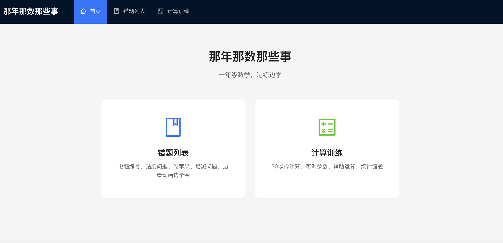
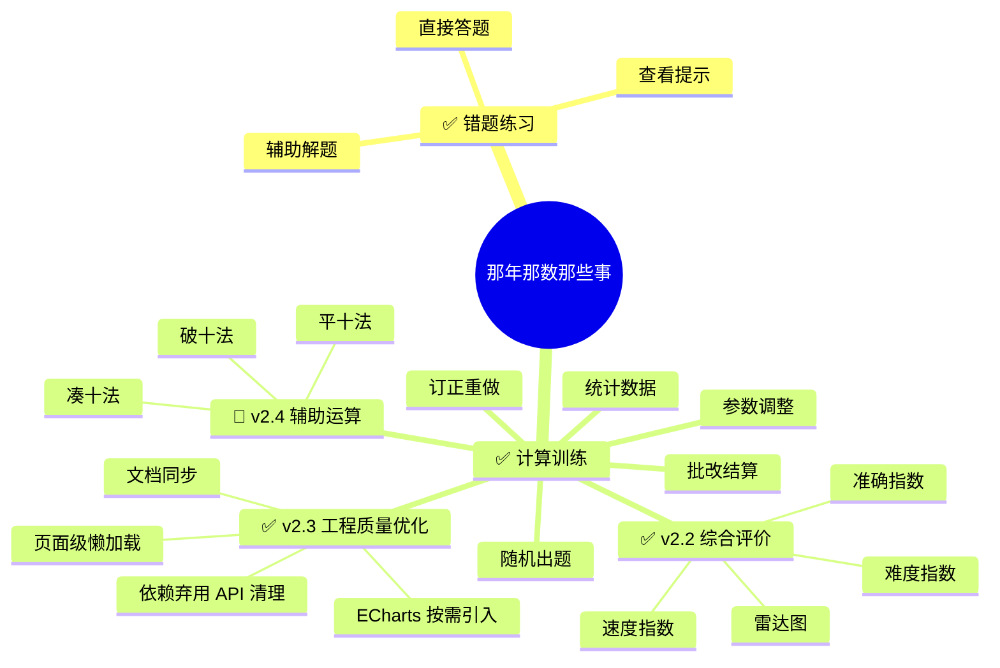
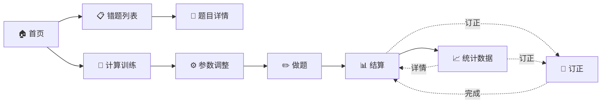

# 那年那数那些事

> 一个帮助一年级小朋友攻克数学易错题的交互式学习网站。

通过**图形动画 + 分步引导**的方式，把每道错题的思维过程可视化，配合随机换参反复练习，真正搞懂而不是背答案。

👉 **在线体验**：<https://soapgu.github.io/that-math-things>

---

## 目录

- [在线地址](#在线地址)
- [技术栈](#技术栈)
- [功能概览](#功能概览)
- [交互模式详解](#交互模式详解)

- [目录结构](#目录结构)
- [开发指南](#开发指南)
  - [环境准备](#环境准备)
  - [启动项目](#启动项目)
  - [目录说明](#目录说明)
  - [如何新增一道题](#如何新增一道题)
- [构建部署](#构建部署)
- [更新步骤](#更新步骤)
- [项目命名](#项目命名)
- [功能文档](#功能文档)
- [v2.3 工程质量优化](#v23-工程质量优化)
- [v2.4 规划（辅助运算分步引导）](#v24-规划辅助运算分步引导)

---

## 在线地址

**<https://soapgu.github.io/that-math-things>**

---

## 技术栈

| 类别 | 选择 |
| --- | --- |
| 框架 | Vite 6 + React 19 |
| 语言 | JavaScript (ES6+) |
| UI 组件库 | Ant Design 6 |
| 路由 | react-router-dom v6 |
| 动画引擎 | framer-motion |
| 图形 | `motion.div` + CSS（非 SVG，用 DOM 元素配合 framer-motion 属性动画实现） |
| 图表 | ECharts 6（按需注册） |
| 测试 | Vitest 3 + Testing Library |

---

## 功能概览





### 页面导航



| 路由 | 页面 | 说明 |
| --- | --- | --- |
| `/` | 首页 | 两个入口卡片：错题列表 / 计算训练 |
| `/problems` | 题目列表 | 按知识点分类展示 |
| `/problems/:id` | 题目详情 | 三种互动模式切换 + 随机换参 |
| `/practice` | 计算训练参数 | 调整运算范围/比例/概率/辅助运算/题数 |
| `/practice/session` | 计算训练做题 | 计时 + 随机出题 + 提交下一题 |
| `/practice/result` | 结算页 | 批改得分 + 错误分析 + 逐题详情 |
| `/practice/stats` | 统计数据 | 历史记录 + 错误分布统计 |
| `/practice/correction` | 订正页 | 对本次错题逐题重做，直到全部答对 |

### 三种互动模式

每道题都支持以下三种模式，顶部标签切换：

| 模式 | 交互流程 |
| --- | --- |
| **直接答题** | 显示题目 → 输入答案 → 提交判对错 → 显示结果。支持单答案/多答案、文本输入/选择题（Radio）混合，多答案回车自动跳空或提交。 |
| **查看提示** | 显示思考指引文字（思路点拨） |
| **辅助解题** | 见下方详解 |

---

## 交互模式详解

### 辅助解题状态流

```
开始
  │
  ▼
自动播放动画演示
  │
  ▼
进入步骤时间线（所有步骤同时可见）
  ┌──────────────────────────────────────┐
  │ ✅ 第 1 步（已完成）  你的答案：13 ✓  │
  │ ✅ 第 2 步（已完成）  你的答案：5  ✓  │
  │ ▶ 第 3 步 ← 当前                    │
  │    ┌─────────────────────┐           │
  │    │  [输入框]    [确认] │           │
  │    └─────────────────────┘           │
  │ ○ 第 4 步（等待）                    │
  └──────────────────────────────────────┘
       │ 每步确认正确 → 自动跳到下一步
       │ 最后一步正确 → 显示完成
       │ 任何一步错误 → 原地重填
       ▼
全部答对 ✅ → 展示所有步骤结果 + 庆祝
```

**关键规则：**
- 动画自动播放，可跳过
- 所有步骤同时显示在时间线中，已完成/当前/未到一目了然
- 每步正确后输入框自动聚焦到下一步
- 任何一步答错，保留输入框可重填，不阻塞流程
- 最后一步正确即完成全部，无独立的"最终答案"阶段
- 随时可点击「重新开始」或「随机换参」

### 直接答题状态流

```
显示题目 → 随机参数已生成 → 填写答案 → 提交
  ├─ 正确 ✅ 显示正确 + 简要解释
  └─ 错误 ❌ 显示正确答案 + 简要解释
```

**扩展功能：**
- **多答案**：支持一道题有多个填空（如增减问题的"填方向 + 填数量"），每空独立判对错
- **选择题**：答案类型支持 `choice`，渲染为 Ant Design `Radio.Group`，选项可自定义标签和值
- **回车跳空**：多答案时按 Enter，如有空输入则自动跳到下一个空位，全部填满才提交
- **自动聚焦**：首次进入或随机换参后，自动聚焦第一个输入框（支持 Text / Radio）

### 查看提示状态流

```
显示题目 → 点击「查看提示」→ 显示思路文字
  → 用户可切到直接答题或辅助解题继续
```

---


## 目录结构

```
that-math-things/
├── public/
│   ├── index.html
│   └── favicon.ico
├── src/
│   ├── components/                    # 通用组件
│   │   ├── AppLayout/                 # 页面布局 (Header/Content)
│   │   ├── ProblemCard/               # 题目卡片（首页/列表使用）
│   │   └── animations/                # 每道题的可视化动画（motion.div + framer-motion）
│   │       ├── ComputerNumber/        # 题1 电脑编号
│   │       ├── StickerProblem/        # 题2 贴纸问题
│   │       ├── AppleEaten/            # 题3 吃苹果
│   │       └── BasketChange/          # 题4 增减问题
│   ├── pages/                         # 页面
│   │   ├── Home/                      # 首页（两个入口卡片）
│   │   ├── Problems/                  # 题目列表
│   │   ├── ProblemDetail/             # 题目详情（三种模式）
│   │   └── Practice/                  # 计算训练
│   │       ├── Settings/              # 参数调整页
│   │       ├── Session/               # 做题页
│   │       ├── Result/                # 结算页
│   │       ├── Stats/                 # 统计数据页
│   │       └── Correction/            # 错题订正页
│   ├── problems/                      # 题目数据定义
│   │   ├── registry.js                # 题目注册表
│   │   └── data/                      # 每题的定义 + 参数生成器
│   │       ├── computerNumber.js
│   │       ├── stickerProblem.js
│   │       ├── appleEaten.js
│   │       └── basketChange.js
│   ├── hooks/                         # 自定义 Hooks
│   │   ├── useGuidedSolve.js          # 辅助解题状态机
│   │   └── useTimer.js                # 计时器
│   ├── utils/
│   │   ├── random.js                  # 随机参数生成工具
│   │   ├── mathGenerator.js           # 计算题生成器
│   │   ├── marking.js                 # 批改引擎
│   │   ├── evaluation.js              # 综合评价计算
│   │   ├── echarts.js                 # ECharts 按需注册
│   │   └── storage.js                 # localStorage 存储
│   ├── App.jsx                        # 路由配置 + 页面级懒加载
│   └── index.jsx                      # 入口
├── .gitignore
├── package.json
└── README.md
```

---

## 开发指南

### 环境准备

- Node.js >= 18
- npm >= 8

### 启动项目

```bash
# 安装依赖
npm install

# 启动开发服务器
npm start

# 运行测试（TDD）
npm test

# 浏览器会自动打开 http://localhost:5173/that-math-things/
```

### 如何新增一道题

1. 在 `src/problems/data/` 下新建文件，按以下模板定义：

```javascript
// src/problems/data/yourProblem.js
import { getRandomInt } from '../../utils/random';

const createProblem = () => {
  // 1. 生成随机参数
  const param1 = getRandomInt(1, 10);
  const param2 = getRandomInt(1, 10);
  const finalAnswer = param1 + param2;

  // 2. 直接答题的答案定义
  //    - 单答案：answers 数组长度 1
  //    - 多答案：answers 数组长度 > 1，每项独立 label + 判对错
  //    - 选择题：设置 type: 'choice' + options 数组
  const answers = [
    { label: '答案一', answer: finalAnswer },
    { label: '答案二', answer: 5, type: 'choice', options: [
      { label: '选项A', value: 5 },
      { label: '选项B', value: 10 },
    ]},
  ];

  // 3. 分步引导数据
  //    最后一步的 answer 就是最终答案
  const steps = [
    { description: '第一步的题干', hint: '提示文字', answer: '中间结果1' },
    { description: '第二步的题干', hint: '提示文字', answer: '中间结果2' },
    { description: '最终步的题干', hint: '提示文字', answer: finalAnswer },
  ];

  return {
    params: { param1, param2 },
    question: '完整的题目文字，支持 ${param1} 插值',
    hint: '查看提示模式显示的整体思路',
    answers,
    steps,
    finalAnswer,
  };
};

const problem = {
  id: 'your-problem',
  title: '题目标题',
  tags: ['知识点标签'],
  createProblem,
};

export default problem;
```

2. 在 `src/problems/registry.js` 中注册：

```javascript
import yourProblem from './data/yourProblem';

const problemRegistry = {
  'your-problem': yourProblem,
  // ... 已有题目
};
```

3. 在 `src/components/animations/` 下创建动画组件（详见下方「动画组件开发指南」）。

4. 在 `src/pages/ProblemDetail/index.jsx` 的 `AnimationRenderer` 中添加映射：

```javascript
function AnimationRenderer({ problemId, params, onComplete }) {
  switch (problemId) {
    case 'computer-number':
      return <ComputerNumberAnimation params={params} onComplete={onComplete} />;
    case 'your-problem':
      return <YourProblemAnimation params={params} onComplete={onComplete} />;
    // ...
  }
}
```

---

### 动画组件开发指南

动画组件的核心原理是 **状态驱动 + 属性动画**：用 `step` 状态推进时间线，通过 framer-motion 的 `motion.div` 在不同步骤间自动补间过渡。

#### 组件接口

每道题的动画组件接收统一的 props：

```javascript
function YourProblemAnimation({ params, onComplete }) {
  // params:   { key1, key2, ... }  ← 由 createProblem 返回的随机参数
  // onComplete: () => void         ← 动画播放完毕回调，调用后进入步骤填写
}
```

#### 基本结构

```javascript
import React, { useState, useEffect } from 'react';
import { motion } from 'framer-motion';
import { Button } from 'antd';

export default function YourProblemAnimation({ params, onComplete }) {
  const [step, setStep] = useState(0);
  const TOTAL_STEPS = 4;

  // 1. 定时器推进 step
  useEffect(() => {
    if (step < TOTAL_STEPS) {
      const delay = step === 0 ? 2400 : 6600;
      const timer = setTimeout(() => setStep((s) => s + 1), delay);
      return () => clearTimeout(timer);
    }
  }, [step]);

  // 2. 渲染视觉元素
  return (
    <div>
      {elements.map((el) => (
        <motion.div
          key={el.id}
          initial={{ scale: 0, opacity: 0 }}
          animate={{
            scale: 1,
            opacity: 1,
            backgroundColor: step >= 2 ? '#1677ff' : '#b0b0b0',
            x: step >= 3 ? 100 : 0,
          }}
          transition={{ type: 'spring', stiffness: 350, damping: 14 }}
        />
      ))}

      {/* 3. 所有步骤播完显示继续按钮 */}
      {step >= TOTAL_STEPS && (
        <Button type="primary" onClick={onComplete}>继续</Button>
      )}
    </div>
  );
}
```

#### 常用动画技巧

| 效果 | 实现方式 |
| --- | --- |
| **逐步出现** | `delay: (index) * 35ms` |
| **弹跳进入** | `scale: [0, 1.5, 1]`（关键帧数组） |
| **颜色跳变** | 改变 `backgroundColor`，framer-motion 自动补间 |
| **位置移动** | 改变 `x` / `y` 属性 |
| **大小变化** | 改变 `width` / `height` |
| **高亮强调** | 组合 `border`、`boxShadow`、`zIndex` 变化 |
| **闪烁动画** | `animate={{ scale: [1, 1.2, 1] }}` + `transition.repeat` |
| **布局平滑** | `layout` prop 让布局变化自动过渡 |

#### 重要说明

动画并非使用 `<svg>` 元素绘制，而是用 **`motion.div` + CSS** 模拟：
- 每个视觉单元是一个 `motion.div`，通过 `borderRadius` 控制形状
- 布局用 `display: flex` + `flexWrap` 实现排列
- 所有动画由 framer-motion 的 `animate` prop 驱动

---

## 构建部署

```bash
# 构建生产版本
npm run build

# 部署到 GitHub Pages
npm run deploy

# 产物在 build/ 目录，也可手动部署到任何静态服务器
```

---

## 更新步骤

### 日常开发更新

```bash
# 1. 拉取最新代码
git pull

# 2. 安装新依赖（如有 package.json 变更）
npm install

# 3. 启动开发服务器
npm start
```

### 新增题目后的检查清单

- [ ] `src/problems/data/` 下新建了题目定义文件
- [ ] `src/problems/registry.js` 中注册了新题目
- [ ] `src/components/animations/` 下创建了对应的动画组件
- [ ] 题目在首页和列表页正常展示
- [ ] 三种互动模式均可正常使用
- [ ] 随机换参功能正常
- [ ] `npm start` 无报错

### 部署更新

```bash
# 1. 构建
npm run build

# 2. 将 build/ 目录部署到服务器（根据实际部署方式）
# 例如部署到 Vercel / Netlify / Nginx 等

# 3. 验证线上访问正常
```

### Git 工作流

```bash
# 新功能分支
git checkout -b feat/xxx-problem

# 开发完成后
git add .
git commit -m "feat: 新增 xxx 题目"
git checkout main
git merge feat/xxx-problem
git push
```

---

## 项目命名

- 中文名：**那年那数那些事**
- 英文名：`that-math-things`
- 域名（预留）：`thatmaththings.com`

---

*让数学不再可怕，让错题不再反复。*

---

## 功能文档

### 参数设置

| 参数 | 控件 | 说明 |
|---|---|---|
| 运算范围 | InputNumber | 默认 50，可调 10-100 |
| 加法比例 | Slider 0-100% | 剩余为减法 |
| 进位退位概率 | Slider 0-100% | 涉及进位/退位的题占比 |
| 辅助运算 | Switch | 开启后展示分步引导（破十法/平十法） |
| 破十法 / 平十法 | Radio（二选一） | 辅助运算开启时可选 |
| 题目数量 | InputNumber | 默认 10，可调 5-100 |

### 做题流程

```
开始 → 生成题目 → 启动计时
                  ↓
            ┌─────────────┐
            │  a ± b = ?  │
            │  [输入框]    │
            │  [下一题]    │
            └──────┬──────┘
                   ↓ 提交
            ┌─────────────┐
            │ 辅助运算 ON? │
            ├───YES───┬───NO───┐
            │ 展示分步 │ 直接   │
            │ 引导弹窗 │ 跳转   │
            │ 点击继续 │        │
            └─────────┴────────┘
                   ↓
              下一题 / 结束 → /practice/result
```

### 结算与评价

**结算功能**

- 百分制得分：`正确数 / 总数 × 100`
- 总用时显示
- 错误分析标签：错误类型 × 次数展示，含严重错误判定
- 逐题详情：题目、用户答案（划线）、正确答案、对错标记、错误标签 + 点评文案
- 存储空间不足自动清理最旧 100 条并提示
- 「再来一次」「统计数据」「返回首页」按钮
- 自动保存记录到 localStorage

**综合评价体系**

每次练习结算时，对本次练习进行三维度星级评价，并展示雷达图 + 综合评语。

| 维度 | 星级范围 | 说明 |
|---|---|---|
| 难度指数 | 1-5★ | 基于运算范围和进退位权重计算 |
| 准确指数 | 1-5★ | 基于本次得分计算 |
| 速度指数 | 1-5★ | 基于预期用时 vs 实际用时计算 |

难度指数算法：

`difficulty = round(cbWeight × rangeScore × 1.2)`，封顶 5★

```
rangeScore:
  ≤10  → 2
  ≤20  → 3
  ≤50  → 5
  ≤100 → 8

cbWeight:
  无进位退位 → 0.4
  有进位     → 0.7
  有退位     → 0.9
```

| | none(0.4) | 进位(0.7) | 退位(0.9) |
|---|---|---|---|
| ≤10 | 1★ | 2★ | 2★ |
| ≤20 | 1★ | 3★ | 3★ |
| ≤50 | 2★ | 4★ | 5★ |
| ≤100 | 4★ | 5★ | 5★ |

单次练习的难度指数为所有题目难度的平均值（四舍五入取整）。

准确指数算法：

| 得分 | 星级 |
|---|---|
| score = 100 | 5★ |
| score ≥ 90 | 4★ |
| score ≥ 80 | 3★ |
| score ≥ 60 | 2★ |
| score < 60 | 1★ |

速度指数算法：

```
每题预期用时(秒) = f(该题难度★)

  难度 1★ → 3s
  难度 2★ → 5s
  难度 3★ → 8s
  难度 4★ → 12s
  难度 5★ → 15s

session 预期总用时 = Σ 每题预期用时
速度比 = 预期总用时 / 实际用时
```

| 速度比 | 星级 | 含义 |
|---|---|---|
| ≥ 1.3 | 5★ | 很快 |
| ≥ 1.1 | 4★ | 偏快 |
| ≥ 0.8 | 3★ | 正常 |
| ≥ 0.5 | 2★ | 偏慢 |
| < 0.5 | 1★ | 很慢 |

综合评级算法：

准确率占主导，难度和速度对等：

```
加权总分 = 准确 × 0.50 + 难度 × 0.25 + 速度 × 0.25
```

准确率封顶规则（准确是门槛，准确率低时其他维度再高也无意义）：

| 准确指数 | 总分上限 |
|---|---|
| 5★ | 无上限 |
| 4★ | 4.5★ |
| 3★ | 3.5★ |
| 2★ | 2.5★ |
| 1★ | 1.5★ |

公式：`totalStars = round(min(准确×0.50 + 难度×0.25 + 速度×0.25, 上限))`

评级体系：

| 总评星级 | 额外条件 | 评级 | 视觉风格 |
|---|---|---|---|
| 5★ | 三项指数均为 5★ | **UR** | 彩虹渐变 + 闪烁边框，最高荣誉 |
| 5★ | 任意一项 < 5★ | **SSR** | 金色 + 发光 |
| 4★ | — | **SR** | 紫色 |
| 3★ | — | **R** | 蓝色 |
| 1-2★ | — | **N** | 灰色 |

评语基于以下规则生成：

- 判断最弱的维度，针对性给出建议
- 判断最强的维度，给予肯定
- 结合整体表现定性
- 评语文案预写规则化模板，后期可迭代

结算页展示：

```
┌───────────────────────────────┐
│       综合评价                 │
│                               │
│      ╔═══════════════╗        │
│      ║     SSR       ║        │
│      ╚═══════════════╝        │
│                               │
│  ┌──────┐ ┌──────┐ ┌──────┐  │
│  │ ★★★  │ │ ★★★★ │ │ ★★   │  │
│  │ 难度  │ │ 准确  │ │ 速度  │  │
│  └──────┘ └──────┘ └──────┘  │
│                               │
│       [ECharts 雷达图]         │
│                               │
│  评语：计算准确率优秀，但速度    │
│  偏慢，建议多做基础练习提高      │
│  反应速度。                    │
└───────────────────────────────┘
```

评价数据存储（`storage.js` 的 `buildRecord` 中新增）：

```js
{
  id, date, score, ...,    // 原有字段
  evaluation: {
    difficulty: 3,          // 1-5★
    accuracy: 4,            // 1-5★
    speed: 2,               // 1-5★
    composite: {
      totalStars: 4,
      grade: 'SR',          // 'UR' | 'SSR' | 'SR' | 'R' | 'N'
      comment: '...'
    }
  }
}
```

没有 `evaluation` 字段的旧记录，在 Stats 趋势图中忽略不展示。

### 统计数据

- 总练习次数、总题数、平均分、最高分
- 累计错误分布（退位错误 / 进位错误 / 计算错误 + 占比柱状图）
- 最近历史记录列表，支持点击查看详情（Stats → Result 闭环导航）
- 难度/准确/速度三线趋势折线图（仅展示含 evaluation 的记录）
- 清除数据（需确认）

### 订正功能

原题一模一样重做，实时批改直到全对；不写记录、不结算，可在历史记录上反复订正。

### 数据存储

使用 localStorage，保存逻辑：Session 中实时写入，Result 页纯展示。

每条记录结构：

```js
{
  id, date, score, total, correct, wrongCount,
  timeSpent, settings,
  questions: [ /* 原题数据 */ ],
  userAnswers: [ /* 用户答案 */ ],
  results: [
    { isCorrect, errors: string[], detail: string|null }
  ],
  evaluation: {          // v2.2 新增
    difficulty: 3,       // 1-5★
    accuracy: 4,         // 1-5★
    speed: 2,            // 1-5★
    composite: {
      totalStars: 4,
      grade: 'SR',       // 'UR' | 'SSR' | 'SR' | 'R' | 'N'
      comment: '...'
    }
  }
}
```

### v2.3 工程质量优化

本版本优先偿还工程技术债，为后续辅助运算功能提供更稳定的基础。

| 项目 | 调整内容 |
|---|---|
| 首屏性能 | 路由页面改为 `React.lazy` 按页加载，避免一次加载全部业务页面 |
| 图表体积 | ECharts 改为按需注册折线图、饼图、雷达图及所需组件 |
| 构建基线 | 独立缓存块告警阈值设为 600 KB；超过当前 Ant Design/ECharts 基线时继续告警 |
| 路由兼容 | 启用 React Router v7 future flags，提前适配状态更新和相对路径行为 |
| Ant Design 兼容 | `Statistic.valueStyle` 迁移至 `styles.content`，弃用的 `List` 改为语义化列表结构 |
| 文档同步 | 更新 Vite、Vitest、`.jsx` 文件、订正路由和当前版本规划 |

### v2.4 规划：辅助运算分步引导

| 步骤 | 内容 |
|---|---|
| ① | 不进位加减法分步引导 |
| ② | 进位加法（凑10法）分步引导 |
| ③ | 借位破十法分步引导 |
| ④ | 借位平十法分步引导 |
