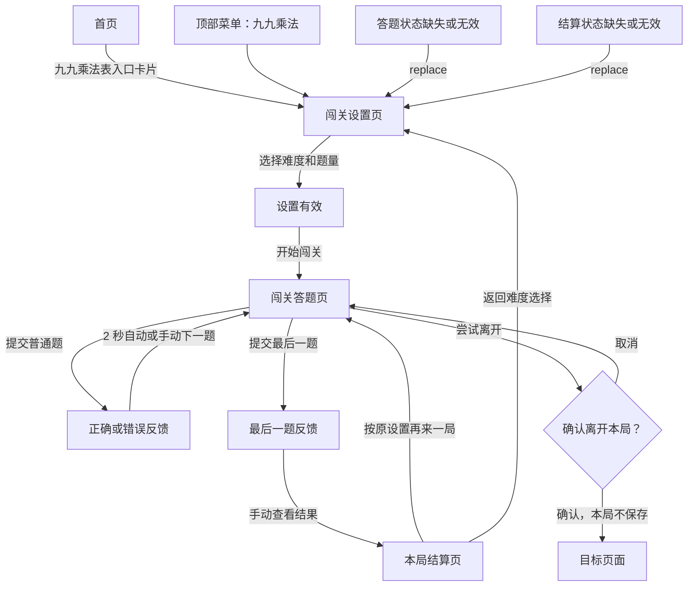
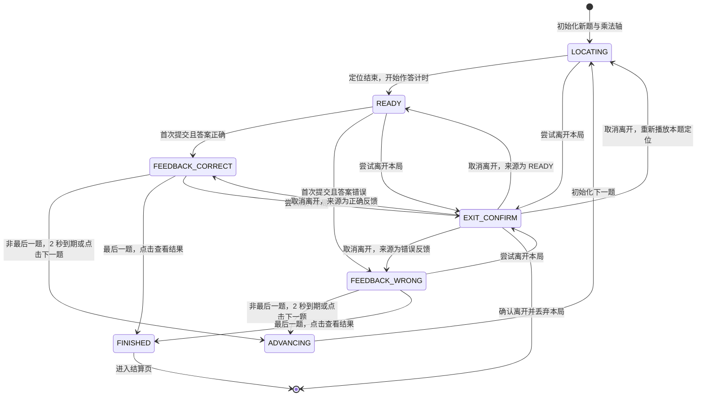
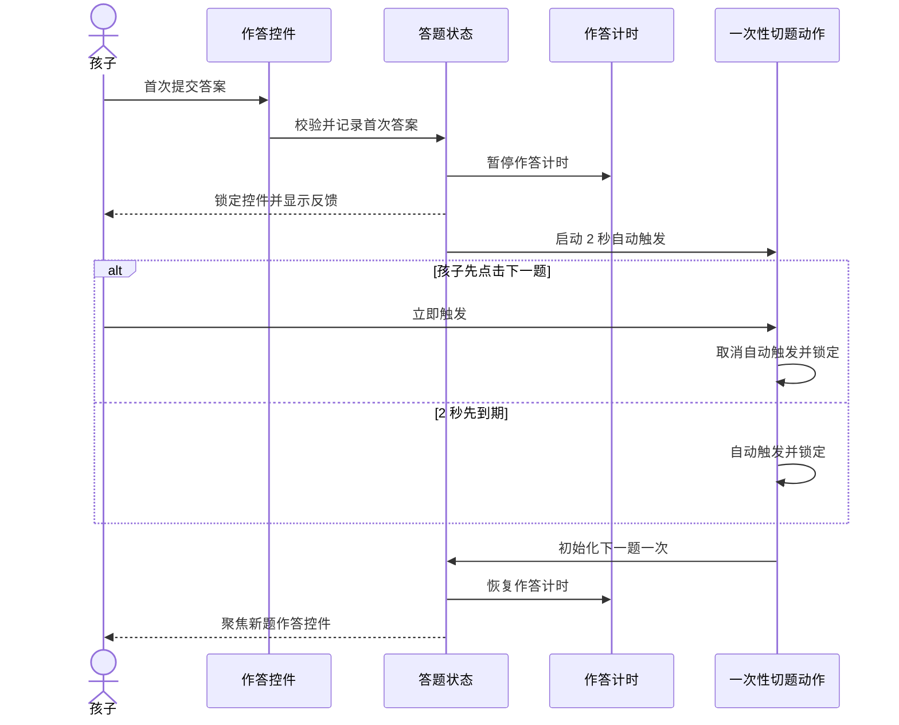
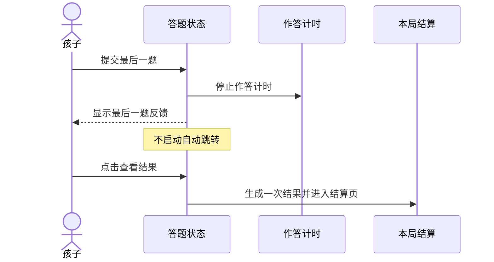
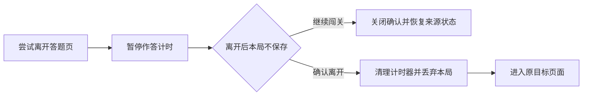

# v2.6 九九乘法闯关 UE 页面流程设计

## 1. 文档目标

本文是 v2.6 步骤 2“UE 页面流程设计”的交付物，用于锁定九九乘法闯关的页面结构、操作流程、答题状态机、计时口径、导航退出、焦点和异常回退规则，并作为步骤 3“低保真交互原型”的直接输入。

本文只定义用户体验和交互行为，不确定最终配色、插画、阴影、动效风格等高保真视觉细节，也不包含业务代码实现。

### 1.1 设计对象

- 主要使用者：小学低年级儿童。
- 共同观察者：家长。
- 支持设备：宽度 `768px` 及以上的平板和电脑。
- 暂不支持：宽度低于 `768px` 的手机小屏。

### 1.2 核心原则

- **先明确问题，再提供工具**：答题页始终先显示算式，再显示矩阵和作答控件。
- **一次提交，一次计分**：每题只记录第一次提交，反馈期间不能改答。
- **及时纠错，不催促阅读**：普通题可自动切换，也允许孩子主动提前进入下一题；最后一题必须手动查看结果。
- **速度只衡量作答**：反馈、离开确认和页面切换不计入速度评星时间。
- **难度只改变支架**：三档难度共用同一主流程，只改变矩阵可见范围和作答控件。
- **辅助技术不泄露答案**：隐藏乘积不能出现在隐藏文本、可访问名称或播报内容中。

## 2. 信息架构与全局导航

### 2.1 顶部导航

顶部菜单增加“九九乘法”，形成四个稳定入口：

1. 首页；
2. 错题列表；
3. 计算训练；
4. 九九乘法。

“九九乘法”在 `/multiplication`、`/multiplication/session` 和 `/multiplication/result` 下保持选中状态。

在最小支持宽度 `768px` 下，应压缩品牌标题区域的占位，优先保证四个菜单项完整可见和可操作。具体品牌缩写、字号和间距在步骤 3、4 验证并固化，本步骤不确定视觉数值。

### 2.2 页面与路由

| 页面 | 路由 | 进入条件 | 主要离开方式 |
|---|---|---|---|
| 首页 | `/` | 无 | 首页卡片或顶部菜单进入设置页 |
| 闯关设置 | `/multiplication` | 无 | 开始闯关、顶部菜单或浏览器返回 |
| 闯关答题 | `/multiplication/session` | 有效设置和本局题目 | 完成本局、确认离开、刷新或关闭 |
| 本局结算 | `/multiplication/result` | 有效本局结果 | 再来一局、返回难度选择或顶部菜单 |

## 3. 全局页面流程

### 3.1 正常主流程

1. 孩子从首页入口卡片或顶部菜单进入闯关设置。
2. 默认选择“简单”和“10 题”，孩子可以改为其他难度或题量。
3. 点击“开始闯关”后生成本局题目并进入答题页。
4. 每题首次提交后显示即时反馈。
5. 非最后一题可等待 2 秒自动切题，也可立即点击“下一题”。
6. 最后一题不自动离开反馈，孩子点击“查看结果”进入结算。
7. 结算页可以按原设置开始新一局，或者返回设置页重新选择。

### 3.2 异常与恢复流程

- 直接访问或刷新答题页，如果没有完整会话状态，使用 `replace` 返回设置页。
- 直接访问或刷新结算页，如果没有完整结果状态，使用 `replace` 返回设置页。
- 不使用默认设置偷偷恢复，不生成新的随机题目，不展示空白答题页或空白结算页。
- 设置页本身可以安全刷新，不需要离开确认。
- 本版本不保存进行中的会话，确认离开后不能恢复本局。

## 4. 页面信息结构

### 4.1 闯关设置页

页面自上而下排列：

1. 页面标题“九九乘法”，与“错题列表”“计算训练”等模块标题保持四字长度；
2. 一句玩法说明；
3. 难度选择；
4. 题量选择；
5. 主操作“开始闯关”。

#### 难度卡片

| 对外名称 | 内部值 | 作答方式 | 矩阵提示说明 |
|---|---|---|---|
| 简单 | `easy` | 四选一 | 显示目标所在整行、整列的其他乘积 |
| 提升 | `medium` | 数字输入 | 只显示目标格上下左右的相邻乘积 |
| 挑战 | `hard` | 数字输入 | 不显示其他乘积 |

- 三张卡片始终可选，不设置解锁关系。
- 默认选中“简单”。
- 选中状态不能只依赖颜色，应同时具有明确标记和可访问选中状态。
- 卡片说明只解释支架差异，不使用“笨”“差”等评价儿童能力的词。

#### 题量

- 提供 `10 / 20 / 50` 三个互斥选项。
- 默认选中 10 题。
- 当前版本不提供自定义题量。

### 4.2 闯关答题页

答题页在 `768px`、`1024px` 和 `1440px` 支持宽度下采用左右两栏：左侧为 9×9 乘法矩阵，右侧依次为紧凑题目状态、当前算式、作答与提交、固定高度反馈区域。题目状态使用“第 1/10 题 · 作答 6 秒”等文字，不使用占用纵向空间的进度条。

新题先进入乘法轴定位，内部时序固定为 `SLIDING → FIRING → REVEALED`：横轴、纵轴滑块用约 `600ms` 从上一题位置移动到本题两个乘数；滑块完全到位后同时发射约半格宽的横纵光束，用约 `800ms` 贯穿完整矩阵并锁定交叉点。整段约 `1.4 秒`，结束后才允许作答并开始计时；减少动态效果时直接呈现定位结果。光束在作答阶段淡化保留，提交后再次强化。

提示乘积随光束经过相应格子依次显现：简单显示完整目标行列，提升只显示目标上下左右相邻格，挑战不显示乘积。简单四选一及提升/挑战目标格输入均在 `REVEALED` 后出现。

反馈区域在 `READY` 状态也预留空间，避免提交后矩阵、算式和主要操作发生明显位移。

#### 三档难度信息结构

| 信息或控件 | 简单 | 提升 | 挑战 |
|---|---|---|---|
| 当前算式 | 显示 | 显示 | 显示 |
| 9×9 坐标框架 | 显示 | 显示 | 显示 |
| 行列标题 1–9 | 显示 | 显示 | 显示 |
| 目标格 | 高亮、提交前留空 | 高亮、提交前留空 | 高亮、提交前留空 |
| 可见乘积 | 目标整行整列 | 上下左右相邻格 | 无 |
| 作答方式 | 右侧四选一 | 目标格内正整数输入 | 目标格内正整数输入 |
| 提交方式 | 点击选项即提交 | 提交按钮或 Enter | 提交按钮或 Enter |
| 提交后目标格 | 填入正确答案并标记对错 | 填入正确答案并标记对错 | 填入正确答案并标记对错 |
| 提交后对称格 | 同时显示交换律答案 | 同时显示交换律答案 | 同时显示交换律答案 |

#### 反馈区域

- 答对：显示明确的正确文字和完整算式。
- 答错：同时显示孩子答案与正确算式。
- 非对角线题同时填入目标格和交换律对称格，并说明如“3×4 和 4×3 都等于 12”。
- 两个乘数相同的题只强化一个对角线格，并说明其对称位置就是自己。
- 反馈不能只依赖绿色或红色。
- 非最后一题显示“下一题”，并给出“2 秒后自动进入下一题”的静态提示。
- 最后一题显示“查看结果”，不启动自动跳转。

### 4.3 本局结算页

页面自上而下排列：

1. 一至三星评价；
2. 分数；
3. 正确题数、总题数、可作答用时；
4. 主操作“再来一局”；
5. 次操作“返回难度选择”。

“再来一局”沿用难度和题量，但重新生成题目。结算页不展示：

- 错题列表；
- 历史记录；
- 订正入口；
- 统计图表；
- 辅助使用；
- 综合雷达图。

## 5. 答题状态机

### 5.1 状态定义

| 状态 | 可用操作 | 作答计时 | 关键约束 |
|---|---|---:|---|
| `LOCATING` | 尝试离开 | 暂停 | 不接受提交；定位完成只进入一次 READY |
| `READY` | 选择或输入、提交、尝试离开 | 运行 | 只接受第一次有效提交 |
| `FEEDBACK_CORRECT` | 下一题、尝试离开 | 暂停 | 作答控件锁定，显示正确算式 |
| `FEEDBACK_WRONG` | 下一题、尝试离开 | 暂停 | 作答控件锁定，显示孩子答案和正确算式 |
| `ADVANCING` | 无 | 暂停 | 清理自动切题计时器，只切换一次 |
| `FINISHED` | 查看结果 | 停止 | 只生成一次本局结果 |
| `EXIT_CONFIRM` | 取消、确认离开 | 暂停 | 取消后返回来源状态 |

### 5.2 状态不变量

- `LOCATING` 和反馈状态均不接受答案提交。
- 每道题只有一条首次答案记录。
- 每道题只能执行一次 `ADVANCING`。
- 本局只能生成一次最终结果。
- 自动切题计时器离开反馈状态时必须清理。
- 取消退出后恢复原状态；来源为 `LOCATING` 时重新播放本题定位，来源为 `READY` 时恢复作答计时。

## 6. 即时反馈与切题时序

### 6.1 非最后一题

自动切题和“下一题”必须进入同一个幂等动作。第一次调用立即锁定并清理定时器，之后的调用直接忽略，避免跳过题目。

### 6.2 最后一题

## 7. 离开、返回与刷新

### 7.1 离开确认

未完成本局时，下列行为必须触发“离开后本局不保存”的确认：

- 点击顶部菜单；
- 点击应用内返回或首页入口；
- 使用浏览器返回；
- 跳转到其他应用路由。

- 确认对话框的主次操作应避免误触；“继续闯关”是安全操作，“确认离开”明确说明结果。
- 取消离开后不能重置当前输入、题号、反馈或自动切题剩余状态。
- 如果确认框来自反馈状态，作答计时保持暂停；关闭后继续剩余反馈流程。
- 刷新或关闭标签页使用浏览器支持的原生离开提醒；浏览器不保证自定义文案。

### 7.2 已完成状态

- 进入结算页后，本局已结束，离开不再确认。
- 设置页和结算页的顶部导航可以直接跳转。
- “返回难度选择”使用正常导航，不保留上一局结果。

## 8. 计时口径

用于速度评星的时间定义为所有 `READY` 状态持续时间之和。`LOCATING` 乘法轴定位、反馈、退出确认、页面切换和结算均不计时。

计入：

- 阅读当前算式；
- 查看矩阵；
- 选择答案；
- 输入与提交答案。

不计入：

- 正确或错误反馈；
- 2 秒自动切题等待；
- `ADVANCING` 页面切换；
- 离开确认；
- 结算页停留；
- 浏览器失去会话后重新进入设置页。

页面上展示“作答用时”，避免让家长误解为从开始到结束的墙钟时间。

## 9. 键盘、焦点与播报

### 9.1 键盘和焦点

- 设置页遵循视觉顺序：难度 → 题量 → 开始闯关。
- 简单难度进入新题后，焦点定位到第一个选择项。
- 提升、挑战进入新题后，焦点定位到数字输入框。
- 数字输入按 Enter 等同点击提交；反馈期间 Enter 不得再次提交答案。
- 反馈出现后，焦点定位到“下一题”或“查看结果”。
- 自动切题后焦点进入新题对应的作答控件。
- 离开确认关闭后，焦点返回触发离开的控件或原作答状态。
- 焦点顺序与视觉阅读顺序一致，不允许隐藏格进入 Tab 顺序。

### 9.2 状态播报

- 题目切换时播报当前题号和算式，不播报整张矩阵。
- 正确反馈播报“回答正确”及完整算式。
- 错误反馈播报孩子答案和正确算式。
- “2 秒后自动进入下一题”只做一次礼貌播报，不逐秒播报倒计时。
- 隐藏乘积格不提供答案型 `aria-label`、隐藏文本或 tooltip。

### 9.3 减少动态效果

- 启用 `prefers-reduced-motion: reduce` 时取消缩放、位移和庆祝动画。
- 状态顺序、2 秒反馈停留、手动下一题、焦点和播报规则保持不变。
- 任何关键反馈都不能依赖动画才能被理解。

## 10. 低保真原型验证清单

步骤 3 必须验证以下问题，并记录结论：

| 编号 | 待验证问题 | 验证宽度或场景 | 通过标准 |
|---|---|---|---|
| U1 | 四项顶部导航是否拥挤 | 768px | 菜单完整可见、可点击，无横向滚动 |
| U2 | “算式→矩阵→作答”是否自然 | 三档难度 | 孩子无需往返寻找当前问题和答案入口 |
| U3 | 简单整行整列是否信息过多 | 中心格与边界格 | 能看出规律，目标格仍是第一视觉焦点 |
| U4 | 提升相邻提示是否足够 | 中心、边缘、四角 | 相邻关系可理解，边界缺少方向不会造成误解 |
| U5 | 9×9 矩阵数字是否可辨认 | 768/1024/1440px | 无横向滚动，标题、提示和目标格均可读 |
| U6 | 固定反馈区域是否防止跳动 | 正确、错误、最后一题 | 提交前后矩阵和主要操作位置稳定 |
| U7 | 2 秒反馈是否足够阅读 | 答错且算式较长 | 能读完孩子答案与正确算式，可手动提前切题 |
| U8 | 焦点切换是否自然 | 键盘完整完成一局 | 无焦点丢失、重复提交或意外跳题 |
| U9 | 离开确认是否可理解 | READY 与反馈状态 | 取消后状态完整，确认后明确丢弃本局 |
| U10 | 最后一题是否会错过反馈 | 正确和错误 | 不自动跳转，必须点击“查看结果” |

## 11. 步骤 2 完成结论

本设计已经明确：

- 所有页面的进入条件、主要操作、离开条件和异常回退；
- 答题状态、事件、计时和焦点规则；
- 自动与手动切题的一次性约束；
- 三档难度一致的主流程及不同的提示、作答方式；
- 交给低保真原型验证的页面和问题范围。

步骤 2“UE 页面流程设计”完成，下一步进入步骤 3“低保真交互原型”。
