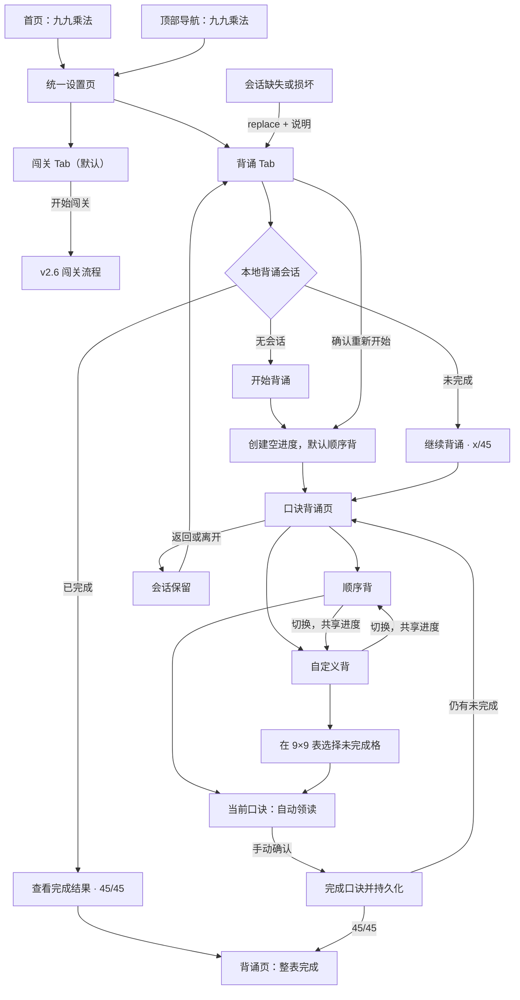
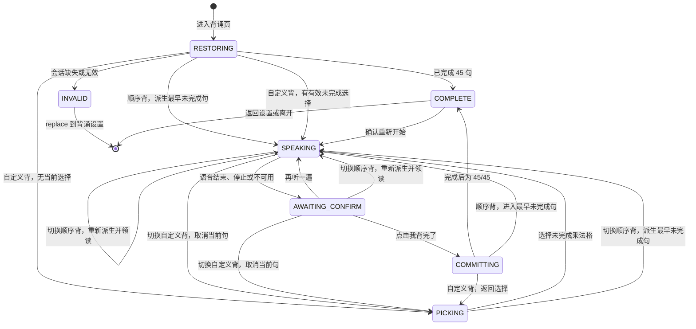
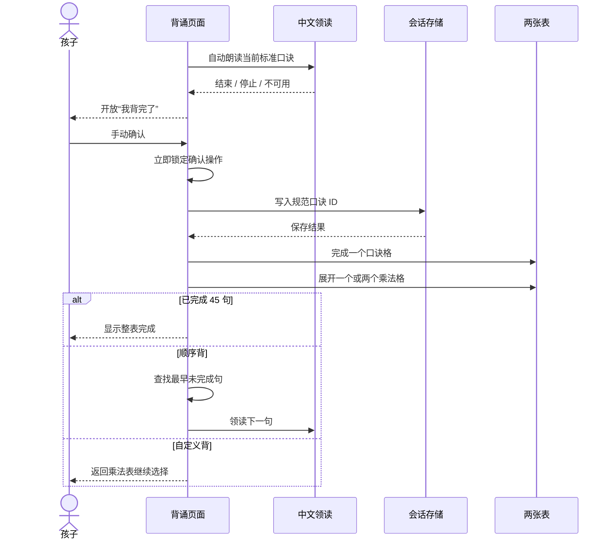

# v2.7 九九乘法口诀背诵 UE 页面流程设计

## 1. 文档目标

本文是 v2.7 步骤 2“UE 页面流程设计”的交付物，用于锁定统一九九乘法设置页、背诵页面结构、顺序与自定义背诵流程、逐句状态机、语音生命周期、会话恢复、重置、焦点和异常回退规则，并作为步骤 3“低保真交互原型”的直接输入。

本文只定义用户体验和交互行为，不确定最终配色、插画、阴影、动效风格等高保真视觉细节，也不包含业务代码实现。

### 1.1 设计对象

- 主要使用者：小学低年级儿童；
- 共同观察者：家长；
- 支持设备：宽度 `768px` 及以上的平板和电脑；
- 暂不支持：宽度低于 `768px` 的手机小屏。

### 1.2 核心原则

- **一个入口，两种学习方式**：首页和顶部导航只保留一个“九九乘法”，设置页再选择闯关或背诵。
- **目标始终是完整 45 句**：顺序背和自定义背只改变下一句来源，不切分长期范围。
- **系统领读，孩子确认**：语音负责示范，只有孩子手动确认才完成口诀。
- **一份进度，随时切换**：两种背诵方式共享完成集合，切换时不丢失、不重复。
- **交换律可操作、可观察**：自定义点击保留算式方向，完成后同时展开对称格。
- **会话可恢复**：刷新或离开不会丢失当前轮，只有明确重置才清空。
- **关键状态不只靠颜色**：当前、已完成、禁用和语音状态均提供文字、边框或图标提示。

## 2. 信息架构与路由

### 2.1 顶部导航

顶部菜单保持四个稳定入口：首页、错题列表、计算训练、九九乘法。

- `/multiplication`、`/multiplication/session`、`/multiplication/result` 和 `/multiplication/recitation` 均选中“九九乘法”；
- 从首页或其他模块点击“九九乘法”进入 `/multiplication?mode=challenge`；
- 在背诵页点击已选中的“九九乘法”返回 `/multiplication?mode=recitation`；
- 背诵会话已经持久化，离开背诵页不弹丢弃确认。

### 2.2 页面与路由

| 页面 | 路由 | 进入条件 | 主要离开方式 |
|---|---|---|---|
| 首页 | `/` | 无 | 首页卡片或顶部导航进入九九乘法设置 |
| 统一设置 | `/multiplication?mode=challenge` | 无 | 开始闯关、切换 Tab、顶部导航 |
| 背诵设置 | `/multiplication?mode=recitation` | 无 | 开始/继续/查看完成结果、切换 Tab |
| 闯关答题 | `/multiplication/session` | 有效闯关路由状态 | 沿用 v2.6 流程 |
| 闯关结算 | `/multiplication/result` | 有效闯关结果 | 沿用 v2.6 流程 |
| 口诀背诵 | `/multiplication/recitation` | 有效本地背诵会话 | 返回背诵设置、顶部导航、浏览器返回 |

### 2.3 设置 Tab 查询参数

- `mode=challenge` 显示闯关设置；
- `mode=recitation` 显示背诵设置；
- 缺少、为空、重复或不支持的值统一规范为 `challenge`；
- 点击 Tab 使用 `replace` 更新查询参数，不为每次切换增加浏览器历史；
- Tab 本身使用可访问的 `tablist / tab / tabpanel` 语义和键盘行为；
- 切换 Tab 不清空闯关表单，也不修改背诵会话。

## 3. 全局页面流程

### 3.1 正常主流程

1. 孩子从首页或顶部导航进入统一九九乘法设置，默认看到闯关 Tab。
2. 点击背诵 Tab 后，页面读取独立背诵会话并显示开始、继续或完成状态。
3. 首次点击“开始背诵”创建空会话，以顺序背进入第一句“一一得一”。
4. 当前句自动领读一次，朗读结束后等待孩子手动确认。
5. 确认后先持久化完成集合，再更新口诀格和交换律乘法格。
6. 顺序背自动进入最早未完成句；自定义背返回 9×9 表等待下一次选择。
7. 孩子可随时切换两种模式，已完成口诀保持不变。
8. 第 45 句完成后显示整表完成，不自动重置或跳转。

### 3.2 恢复与异常流程

- 直接访问背诵页但没有有效会话时，使用 `replace` 返回背诵设置 Tab，并显示“还没有开始背诵，请先开始”。
- 刷新背诵页时从本地恢复模式、完成集合和当前句；处于语音播放中的瞬时状态不恢复，页面重新进入当前句并重新领读。
- 如果保存的当前句已经完成或与模式不一致，按完成集合重新派生安全状态：顺序背定位最早未完成句，自定义背回到选择状态。
- 损坏、越界、重复或版本不兼容的数据不部分猜测恢复，规范为安全空会话，并在背诵设置提示重新开始。
- localStorage 写入失败时保留当前页面内进度，并提示“本次可以继续，但离开后可能无法恢复”；不能回滚已显示的完成结果。
- 语音不可用或播放失败时直接进入手动确认状态，不改变会话数据。

## 4. 统一设置页信息结构

页面自上而下排列：

1. 标题“九九乘法”；
2. 一句总说明；
3. “闯关 / 背诵”Tab；
4. 当前 Tab 的设置或会话卡片；
5. 当前 Tab 的主操作。

### 4.1 闯关 Tab

- 保留 v2.6 的难度、题量、默认值和“开始闯关”；
- Tab 化只改变外层信息架构，不修改三档难度、题目生成或路由状态；
- 切换到背诵再返回时，当前页面内闯关设置保持不变；刷新后仍按 v2.6 默认设置处理。

### 4.2 背诵 Tab

#### 无会话

- 标题“口诀背诵”；
- 说明“按顺序背，或从乘法表自由选择；背完一句，点亮相关算式”；
- 展示空进度 `0/45`，不展示虚假的历史成绩；
- 主操作“开始背诵”。

#### 未完成会话

- 展示 `已背 x/45 句` 和简洁进度条；
- 显示上次使用的方式“顺序背”或“自定义背”；
- 主操作“继续背诵”；
- 次操作“重新开始”。

#### 已完成会话

- 展示 `45/45` 和“整张口诀表已经背完”；
- 主操作“查看完成结果”；
- 次操作“重新开始”。

#### 重新开始确认

- 文案明确说明“已完成的口诀会全部清空”；
- 安全操作“继续保留”作为默认焦点；
- 破坏性操作“清空并重新开始”使用明确危险样式；
- 清空成功后立即以顺序背进入第一句，不需要再次点击开始。

## 5. 背诵页面信息结构

页面保持四个稳定区域：

1. **顶部状态区**：返回背诵设置、`已背 x/45`、重新开始；
2. **背诵方式切换**：“顺序背 / 自定义背”，共享进度；
3. **当前句卡片**：算式、标准口诀、语音状态、重播和手动确认；
4. **双表工作区**：乘法表和口诀表始终位于同一页面并同步更新。

### 5.1 模式与双表关系

- 两张表始终显示，不提供“口诀表 / 乘法表”切换，不隐藏其中一张；
- 自定义背只有乘法表承担选择入口，口诀表只展示同一份进度；
- 顺序背的乘法表只展示展开与当前关联，不允许点击改变顺序；
- 当前口诀、当前算式及交换律对称格在两张表中同步高亮；
- `1440×900` 使用左右并排，并允许背诵页突破应用通用 `960px` 内容宽度，为两张表提供足够空间；
- `768×1024` 使用上下排列，当前句卡片在滚动时保持可见，乘法表在上、口诀表在下；
- `1024×768` 在步骤 3 同时验证左右并排和上下排列，以“文字可读、触控准确、无横向滚动”为准确定稿；无论采用哪种布局，两张表都保留在同一页面；
- 响应式变化只改变排列方式，不改变表格状态、功能或阅读顺序。

### 5.2 口诀表视图

- 使用九行下三角结构，行 `n` 包含 `1×n` 至 `n×n`；
- 未背格显示占位或口诀索引，不提前显示完整口诀结果；
- 当前格显示清晰定位和“正在背”；
- 已背格显示完整标准口诀及完成标记；
- 顺序背时自动将当前格滚动或定位到可见区域；
- 自定义背时口诀格不承担选择入口，避免与 9×9 表产生两个操作源。

### 5.3 乘法表视图

- 显示行列标题 1–9 与 81 个乘法格；
- 未完成格不显示乘积；
- 已完成普通口诀的两个对称格都显示乘积和完成标记；
- 已完成平方口诀只显示一个对角格；
- 自定义背中，未完成格可选，已完成格禁选；
- 点击未完成格后，该格成为当前选择；对称格显示关联轮廓，但不提前显示乘积；
- 顺序背中，当前规范格与对称格显示关联定位，但所有格均不作为选择按钮；
- 当前、可选、已完成和禁用状态不能只依赖颜色。

### 5.4 当前句卡片

无当前句时：

- 顺序背会立即派生最早未完成句，不长期停留空状态；
- 自定义背显示“请从乘法表选择一句想背的口诀”。

有当前句时依次显示：

1. 当前算式，保留自定义点击方向；
2. 标准中文口诀，始终使用规范方向；
3. 语音状态“正在领读 / 轮到你背 / 语音不可用”；
4. “停止领读，自己背”或“再听一遍”；
5. 主操作“我背完了”。

- 自动领读期间“我背完了”禁用，避免连续误触跳过；
- 孩子可以点击“停止领读，自己背”提前进入可确认状态；
- 语音自然结束、主动停止或不可用后，“我背完了”可用；
- 确认后按钮立即锁定，完成写入只能执行一次。

## 6. 背诵状态机

### 6.1 状态定义

| 状态 | 可用操作 | 关键约束 |
|---|---|---|
| `RESTORING` | 无 | 不闪现空表或错误进度 |
| `PICKING` | 选未完成格、切顺序背、切视图、离开 | 只有自定义背可进入；已完成格不可触发 |
| `SPEAKING` | 停止领读、切模式、离开 | 确认按钮禁用；离开状态时必须取消语音 |
| `AWAITING_CONFIRM` | 重播、确认、切模式、离开 | 当前句尚未完成；重播不改进度 |
| `COMMITTING` | 无 | 当前规范 ID 只能加入完成集合一次 |
| `COMPLETE` | 查看两张完整表、重新开始、离开 | 保留 45/45，不自动清空 |
| `INVALID` | 返回设置 | 使用 replace，不能进入可操作空页面 |

### 6.2 状态不变量

- `completedPhraseIds` 始终是 45 个规范 ID 的无重复子集；
- 只有 `COMMITTING` 可以增加完成集合；
- 同一句普通口诀完成后两个对称格同步展开；
- `SPEAKING` 离开时始终取消当前 utterance；
- 自定义模式没有有效当前句时必须处于 `PICKING`；
- 顺序模式未完成时必须能派生唯一的最早未完成句；
- `COMPLETE` 必须满足 45 个口诀格与 81 个乘法格全部完成。

## 7. 逐句确认与交换律时序

- 视觉更新与持久化使用同一个一次性确认动作；快速双击不得完成两句。
- localStorage 写入失败时仍更新内存和界面，但必须显示非阻断恢复风险提示。
- 交换律对称格只表达同一句口诀的两个坐标，不产生第二条完成记录。

## 8. 模式切换规则

### 8.1 顺序背切到自定义背

- 取消正在播放的语音；
- 未确认的当前句不计为完成；
- 清空瞬时当前句和选择坐标；
- 滚动或定位乘法表，并聚焦第一个未完成格或上次浏览位置；
- 已完成集合保持不变。

### 8.2 自定义背切到顺序背

- 取消正在播放的语音；
- 未确认的自选句不计为完成；
- 清空自选坐标；
- 查找传统顺序中最早未完成句；
- 定位口诀表当前格并重新领读；
- 已完成集合保持不变。

## 9. 返回、离开、刷新与重置

### 9.1 返回和离开

- 背诵进度每次确认后立即保存，因此顶部导航、应用返回和浏览器返回不弹离开确认；
- 返回目标统一为 `/multiplication?mode=recitation`；
- 离开时取消语音和瞬时 UI 定时器；
- 未确认的当前句不写入完成集合，重新进入时按安全派生规则恢复。

### 9.2 刷新

- 刷新后恢复完成集合和最近模式；
- 顺序背定位最早未完成句；
- 自定义背只有保存的选择坐标仍指向未完成口诀时才恢复该句，否则回到选择状态；
- 刷新后重新开始当前句领读，不尝试恢复语音播放进度。

### 9.3 重置

- 设置页和背诵页均可发起重新开始；
- 确认前不停止当前会话或改变完成格；
- 确认后取消语音、清空完成集合、模式设为顺序背、当前句设为第一句；
- 重置后立即进入“一一得一”的领读，不出现短暂 45/45 或旧格残留。

## 10. 键盘、焦点、播报与减少动态效果

### 10.1 设置页

- 焦点顺序：闯关/背诵 Tab → 当前面板内容 → 主操作 → 重新开始；
- 左右方向键按标准 Tab 语义切换，Enter/Space 激活；
- 切换 Tab 后焦点停留在新 Tab，屏幕阅读器可获知面板名称。

### 10.2 背诵页面

- 进入顺序背后焦点先到当前句标题，领读结束后移到“我背完了”；
- 自定义背进入乘法表采用单一 Tab 停靠点和方向键网格导航；
- 方向键可在 9×9 坐标中移动，Enter/Space 只选择未完成格；
- 已完成格可被阅读但不可激活，不加入独立 Tab 停靠点；
- 确认后顺序背聚焦新当前句，自定义背聚焦刚完成格之后的下一个未完成格；
- 模式切换后焦点进入新模式的主要操作区；
- 重置确认关闭后焦点返回触发按钮，确认重置后进入第一句标题。

### 10.3 状态播报

- 进入当前句时礼貌播报“当前口诀”和算式方向，不播报整张表；
- 手动确认后播报“已完成 x/45”；
- 自定义选择已完成格时不触发操作，辅助名称明确“已完成，不可选择”；
- 语音合成是学习音频，不替代可访问文本；状态 live region 避免重复朗读整句口诀；
- 整表完成播报一次“45 句全部背完，乘法表已经全部展开”。

### 10.4 减少动态效果

- `prefers-reduced-motion: reduce` 下取消格子翻转、缩放、位移和整表庆祝动画；
- 仍保持逐句确认、交换律双格同步更新、焦点和状态播报；
- 语音领读不属于视觉动效，不因减少动态效果自动关闭。

## 11. 低保真原型验证清单

| 编号 | 待验证问题 | 场景 | 通过标准 |
|---|---|---|---|
| R1 | 统一设置页双 Tab 是否清楚 | 首次从首页进入 | 默认闯关明确，孩子能找到背诵且不误解为难度 |
| R2 | 双表同步布局是否清楚且可读 | 768/1024/1440 | 1440 左右并排、768 上下排列；1024 确定最清晰方案，均无横向滚动 |
| R3 | 顺序背的逐句节奏是否自然 | 前两组与跨组 | 领读、跟背、确认、下一句之间无催促或空档混乱 |
| R4 | 自定义选择是否可理解 | 点击 `1×9` 与 `9×1` | 显示点击方向，朗读相同标准口诀，完成后双格禁用 |
| R5 | 高密度 9×9 表是否适合触控和键盘 | 中心、边缘、对角格 | 可准确选择，当前/已完成/禁用状态清楚 |
| R6 | 口诀表 45 格是否可读 | 未背、当前、已完成混合 | 不提前泄露未背全文，当前句可快速定位 |
| R7 | 模式切换是否造成进度误解 | 语音中与待确认时切换 | 未确认句不完成，已完成集合不变，新模式定位正确 |
| R8 | 刷新和返回是否符合预期 | 顺序、自定义、完成态 | 会话恢复安全，无退出确认，无重叠语音 |
| R9 | 重置是否防误触 | 12/45 与 45/45 | 取消完整保留，确认后立即回到 0/45 第一条 |
| R10 | 语音不可用时是否仍能完成 | 禁用 speechSynthesis | 文本、重播降级说明和手动确认流程完整 |
| R11 | 焦点是否自然 | 仅键盘完成选择与确认 | 无焦点丢失、重复完成或对已完成格误激活 |
| R12 | 整表完成是否明确 | 第 45 句 | 45 个口诀格和 81 个乘法格完成，不自动重置 |

## 12. 步骤 2 完成结论

本设计已经明确：

- 首页单入口与统一设置页双 Tab 的路由、默认值和返回规则；
- 顺序背、自定义背、表格视图和当前句卡片的信息结构；
- 自动领读、手动确认、交换律展开和一次性写入时序；
- 模式切换、刷新恢复、异常数据、离开和重置行为；
- 键盘、焦点、状态播报、语音降级和减少动态效果规则；
- 交给低保真原型验证的页面、状态和问题清单。

步骤 2“UE 页面流程设计”完成，下一步进入步骤 3“低保真交互原型”。
